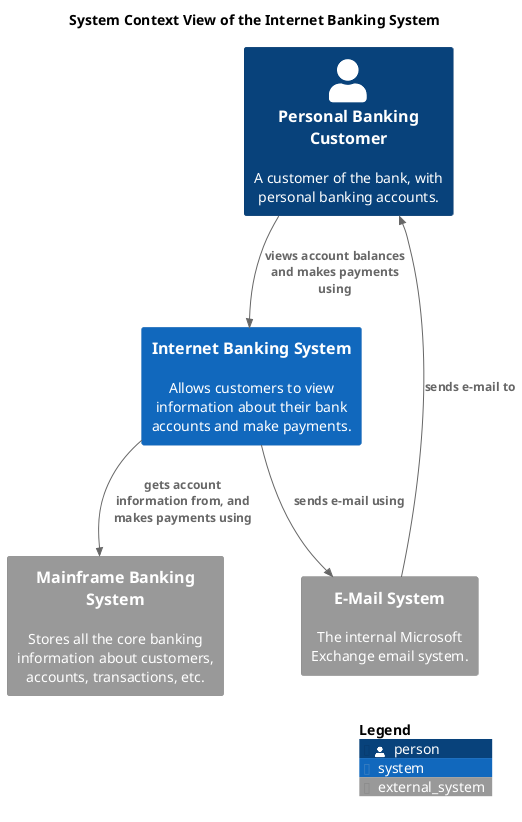

# Overarch
Overarch provides an ontology and a data driven model of software systems
and organizations based on e.g. UML and the C4 model.

Model your system as data and specify/generate representations (e.g.
diagrams) for your system. All core and supplementary C4 diagrams except code
diagrams are supported. Also UML use case, state machine and class diagrams
are supported.

Overarch is not so much about how to model your architecture (see
[C4 Model](https://c4model.com) for that), but about making these models
composable and reusable.

[](https://clojars.org/org.soulspace.clj/overarch)
[](https://cljdoc.org/d/org.soulspace.clj/overarch)


## Features
* Models to capture architecture on different levels
  * Concepts, use cases, architecture, state machines, code, deployments, organization structures and processes
* Models and views as data
* Separation of model and views
* Models are queriable, extensible, composeable and reusable
* View specific customization of model elements
* Criteria based model queries
* Template based artifact generation for e.g.
  * Documentation, reports, project templates, code, CI/CD pipelines, custom visualizations
* Diagram generation
  * PlantUML
    * All C4 views, use case, state machine and code diagrams, structure
     diagrams for organizations, systems and deployments
    * Styling and sprite support
  * GraphViz
    * Concept maps
    * Model view of all elements
* Model exports
  * JSON if you need to process models with languages without EDN support
  * Structurizr *experimental*
* Watch model directories for changes

## Rationale
UML and C4 models are great to model and vizualize an architecture on different
levels of detail with the various diagrams types. The value lies in an
expressive description and visualization of an architecture with different
views.

But the models used for diagram generation with the existing diagram tools are
not models in the sense of generality. E.g. if you describe your model in
PlantUML files, these descriptions are mere textfiles. These textfiles don't
compose and you can't do anything else with these descriptions other than
render them with PlantUML. The parsing process is opaque and you don't have
access to the data of the model. Also the model is complected with the
diagrams, as layout and rendering information is part of the model description
and vice versa. The model should capture the essence of the architecture and
not its representation.

If the model is described as plain *data* in an open format, it can be
transformed into a graphical representation, e.g. into PlantUML textfiles, via
the specification of views on the model.

In Overarch the model data is separated from information about these
representations. Models can be composed with these views and with other models.
By doing so, the model may also be used in other ways, e.g. the generation of documentation, code or infrastructure.

Even if the model is specified as data, the format is a text file (EDN, JSON)
to be easily edited with text editors by the whole team and to be committed to version control, instead of being in some propriatory binary format.

The native format is the Extensible Data Notation (EDN) with representations
in other formats like JSON. EDN is a textual format for data, which is human
readable. It is also directly readable into data structures in clojure or java
code. The data format is also open for extension. E.g. it copes with additional attributes or element types in the data structures.

## Example
This is an example of the specification of a model and some diagrams based on
the Internet Banking System example of Simon Brown at [C4 Model](https://c4model.com).

The complete model and diagram specifications can be found under
[models/banking](/models/banking).

Further information about modelling with *Overarch* can be found in [Usage](doc/usage.md).

### Example of a model definition

```clojure
#{; actors
  {:el :person
  :id :banking/personal-customer
  :name "Personal Banking Customer"
  :desc "A customer of the bank, with personal banking accounts."}
 ; system under design
{:el :system
 :id :banking.internet-banking/internet-banking-system
 :name "Internet Banking System"
 :desc "Allows customers to view information about their bank accounts and make payments."
 :ct #{{:el :container
        :id :banking.internet-banking/web-app
        :name "Web Application"
        :desc "Deliveres the static content and the internet banking single page application."
        :tech "Clojure, Luminus"}
       {:el :container
        :id :banking.internet-banking/single-page-app
        :name "Single-Page Application"
        :desc "Provides all of the internet banking functionality to customers via their web browser."
        :tech "ClojureScript, Re-Frame"}
       {:el :container
        :id :banking.internet-banking/mobile-app
        :name "Mobile App"
        :desc "Provides a limited subset of the internet banking functionality to customers via their mobile device."
        :tech "ClojureScript, Reagent"}
       {:el :container
        :id :banking.internet-banking/api-application
        :name "API Application"
        :desc "Provides internet banking functionality via a JSON/HTTPS API."
        :tech "Clojure, Pedestal"}
       {:el :container
        :subtype :database
        :id :banking.internet-banking/database
        :name "Database"
        :desc "Stores the user registration information, hashed authentication credentials, access logs, etc."
        :tech "Datomic"}}}
; external systems
 {:el :system
  :id :banking/mainframe-banking-system
  :external true
  :name "Mainframe Banking System"
  :desc "Stores all the core banking information about customers, accounts, transactions, etc."}
 {:el :system
  :id :banking/email-system
  :external true
  :name "E-mail System"
  :desc "The internal Microsoft Exchange email system."}

 ; Context view relations 
 {:el :request
  :id :banking/personal-customer-uses-internet-banking-system
  :from :banking/personal-customer
  :to :banking.internet-banking/internet-banking-system
  :name "Views account balances and makes payments using"
  :tech "HTTPS"}
 {:el :request
  :id :banking.internet-banking/internet-banking-system-uses-email-system
  :from :banking.internet-banking/internet-banking-system
  :to :banking/email-system
  :name "Sends e-mail using"
  :tech "HTTPS, REST"}
 {:el :request
  :id :banking.internet-banking/internet-banking-system-using-mainframe-banking-system
  :from :banking.internet-banking/internet-banking-system
  :to :banking/mainframe-banking-system
  :name "Gets account information from, and makes payments using"}
 {:el :send
  :id :banking/email-system-sends-mail-to-personal-customer
  :from :banking/email-system
  :to :banking/personal-customer
  :name "Sends e-mail to"
  :tech "SMTP"}} 
 ```

### Example of a views specification

```clojure
#{{:el :context-view
  :id :banking/context-view
  :spec {:selection [{:from {:id :banking.internet-banking/internet-banking-system}}
                     {:to   {:id :banking.internet-banking/internet-banking-system}}]
         :include :related
         :plantuml {:sprite-libs [:azure :devicons :font-awesome-5]}}
  :title "System Context View of the Internet Banking System"
  :desc "shows the Internet Banking System and its context"
  :ct [{:ref :banking.email/email-system-sends-mail-to-personal-customer :direction :up}]}

 {:el :container-view
  :id :banking/container-view
  :spec {:selection [{:namespace-prefix "banking.internet-banking"}
                     {:from {:namespace-prefix "banking.internet-banking"}}
                     {:to {:namespace-prefix "banking.internet-banking"}}]
         :include :related
         :plantuml {:sprite-libs [:azure :devicons :font-awesome-5]}}
  :title "Container View of the Internet Banking System"
  :desc "shows the containers of the Internet Banking System and their relations" 
  :ct [{:ref :banking.email/email-system-sends-mail-to-personal-customer :direction :up}]}}
 ```

### PlantUML export of the System Context View


### System Context View rendered with PlantUML


### Container View rendered with PlantUML


## Example Models
Here are some Overarch example model repositories, containing the models and views and also the overarch and plantuml JARs and start scripts:

* [MyBank Model](https://github.com/soulspace-org/my-bank-model) 
  is a show case model of a banking organization.

* [Overarch Models](https://github.com/lsolbach/overarch-models)
  contains some personal models about concepts in software development, e.g. Domain Driven Design,  Cloud Computing, DORA State of DevOps or Clean Architecture.

## Installation
The general way of using Overarch is downloading the `overarch.jar` and 
`templates.zip` from the latest release on the [releases](https://github.com/soulspace-org/overarch/releases)
page and use them in your modelling project.

See [MyBank Model](https://github.com/soulspace-org/my-bank-model) for a simple
project layout and useful start scripts.

### Homebrew on macOS
This project has been packaged in Homebrew for macOS users. Install it using
```
brew install overarch
```

This package includes an `overarch` convenience wrapper which handles tracking
the location of the `overarch.jar` uberjar for you. This `overarch` command can
be substituted for the `java -jar overarch.jar` references throughout this
documentation.

### Visual Studio Code

If you have a clojure environment in some editor or IDE, just use it. Maybe a PlantUML plugin exists for this environment too.

If not, try Visual Studio Code with the **Calva** and **PlantUML** extensions.


With this setup you get an editor for the EDN files with code completion,
syntax check and syntax highlighting.


You also get integrated previews of the exported PlantUML diagrams and the
ability to generate image files in different formats (e.g. PNG, SVG, PDF, ...)
directly from within Visual Studio Code.


PlantUML also needs an installation of [graphviz](https://graphviz.org/download/).
Please read the installation instructions in the PlantUML extension on how to
install graphviz for your operating system.

To get support for icons (PlantUML sprites) from the PlantUML standard library, a recent **plantuml.jar** is highly recommended. Please download it from [PlantUML Releases](https://github.com/plantuml/plantuml/releases) and reference it in the PlantUML extension settings.


## Usage
Use a folder for all the data (e.g. models, view specifications) of a project.
Add EDN files for the model and the view specifications. All the EDN files in the folder will be loaded.

### Command Line Interface
Start the the *Overarch* CLI tool with java.

```
java -jar overarch.jar [options]
```

For example to generate all views for the models with some debug output, use
```
java -jar ./target/overarch.jar -r all --debug
```

*Overarch* currently supports these options

```
Overarch CLI
   
   Reads your model and view specifications and renders or exports
   into the specified formats.

   For more information see https://github.com/soulspace-org/overarch

Usage: java -jar overarch.jar [options].

Options:

  -m, --model-dir PATH                   models     Models directory or path
  -r, --render-format FORMAT                        Render format (all, graphviz, markdown, plantuml)
  -R, --render-dir DIRNAME               export     Render directory
      --[no-]render-format-subdirs       true       Use subdir per render format
  -x, --export-format FORMAT                        Export format (json, structurizr)
  -X, --export-dir DIRNAME               export     Export directory
  -w, --watch                            false      Watch model dir for changes and trigger action
  -s, --select-elements CRITERIA                    Select and print model elements by criteria
  -S, --select-references CRITERIA                  Select model elements by criteria and print as references
      --select-views CRITERIA                       Select and print views by criteria
      --select-view-references CRITERIA             Select views by criteria and print as references
  -T, --template-dir DIRNAME             templates  Template directory
  -g, --generation-config FILE                      Generation configuration
  -G, --generation-dir DIRNAME           generated  Generation artifact directory
  -B, --backup-dir DIRNAME               backup     Generation backup directory
      --scope NAMESPACE                             Sets the internal scope by namespace prefix
      --[no-]model-warnings              true       Returns warnings for the loaded model
      --[no-]model-info                  false      Returns infos for the loaded model
      --plantuml-list-sprites            false      Lists the loaded PlantUML sprites
  -h, --help                                        Print help
      --debug                            false      Print debug messages
```

If you use Visual Studio Code as described above, you can start *Overarch* in watch mode from a terminal inside VS Code. Every time you save some changes in the EDN files, the views will be updated and previews can be rendered with the PlantUML extension.

## Documentation
See [Usage](doc/usage.md) for additional information on modelling and usage of the *Overarch* CLI tool.

See [Design](doc/design.md) for information about the design of *Overarch*.

## Build
Overarch is written in [Clojure](https://clojure.org) and gets built with
[leiningen](https://leiningen.org/). To build it, you need to have Java 11 or higher
and leiningen installed.

In the cloned overarch repository, run

```
lein uberjar
```

to build a JAR file with all dependencies. This JAR file is created in the *target* folder and is named *overarch.jar*


## Copyright
© 2023 Ludger Solbach

## License
Eclipse Public License 1.0 (EPL1.0)

