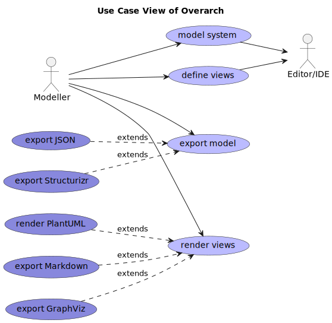
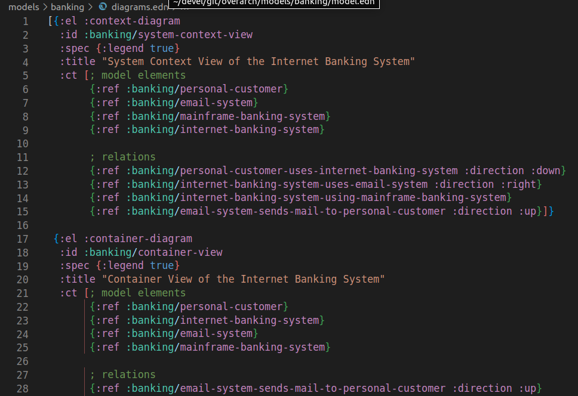
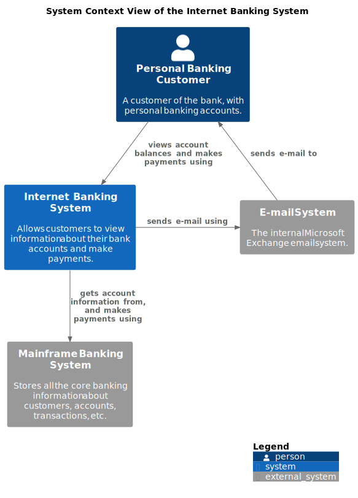
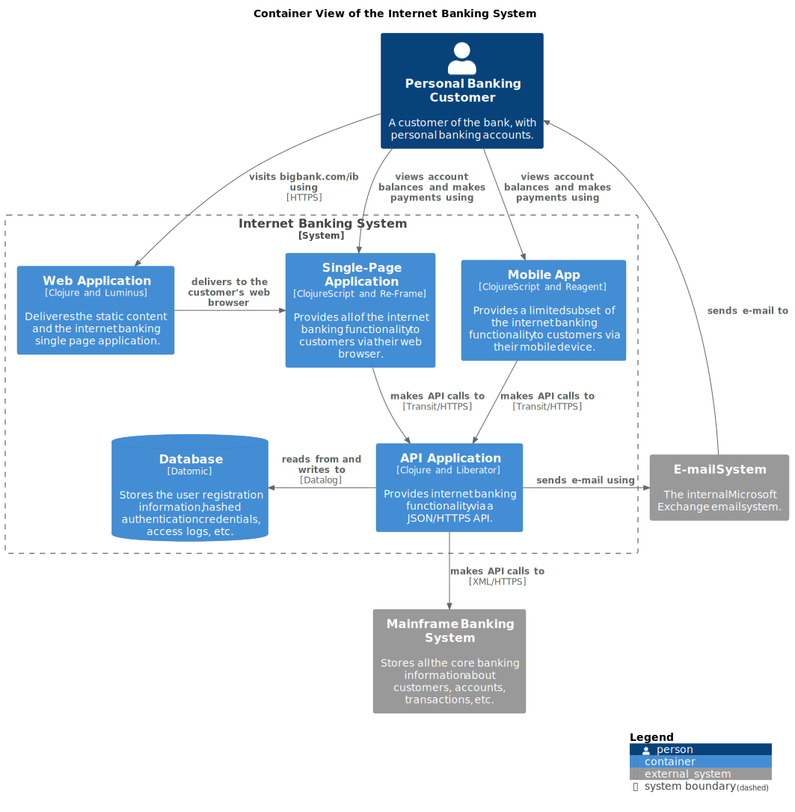

## Overarch
### Data Driven System Modelling
### Ludger Solbach


---
<!-- paginate: true -->
<!-- header: "Overarch - Data Driven System Modelling" -->
<!-- footer: "Ludger Solbach" -->

---

### The Challenge

Understand complex software systems

---

### Problems

* (accidential) complexity of the system
* bad or unknown architecture
* missing or bad documentation
* no vizualizations
* not enough view points

---

### Manifestations

* different mental models about the system
* knowledge in a few heads only
* lost knowledge when people leave the project
* problems onboarding new collegues
* reverse engineering necessary to implement changes

---

### Accelerate State of DevOps 2021

* Good quality documentation
  * helps readers to accomplish their goals
  * is accurate, up-to-date and comprehensive
  * is findable, well organized and clear

* Good quality documentation is an indicator of team performance

---

### Accelerate State of DevOps 2021

* Teams with quality documentation are
  * 3.8x more likely to implement security practices
  * 2.4x more likely to meet their reliability targets
  * 3.5x more likely to implement SRE practices
  * 2.5x more likely to fully leverage the cloud
  * 2.4x more likely to see better software delivery and operational performance

---

### Accelerate Recommendations

* document critical use cases for your products
* create clear guidelines for updating existing documentation
* define owners
* include documentation as part of the dev process
* recognize documentation work during performance reviews and promotions

---

### Diagramming vs. Modelling

* Diagrams are
  * just one representation of information
  * 'boxes and lines' only
  * not queriable
  * not reusable
  * hard to diff and version
  * missed opportunities

---

### Diagramming Tools

* Visio, Draw.io, Excalidraw, ...
* [PlantUML](https://github.com/plantuml/plantuml), [Mermaid](https://mermaid.js.org/)

---

### Models

* A model is
  * a description of the elements and relations
  * an abstraction of reality
  * independent of the representations (views, diagrams)
  * queriable, transformable, exportable

---

### Modelling Tools

* Enterprise Architect, Magic Draw, [Structurizr](https://structurizr.com/) 
* [Overarch](https://github.com/soulspace-org/overarch) 

---

### Modelling in Domain Driven Design

Model:
A system of abstractions that describes selected aspects of a domain and can be used
to solve problems related to that domain.

Modelling is central to Domain Driven Design

---

### Modelling Languages

* [C4 Model](https://c4model.com)
* UML
* SDML
...

---

### C4 Model

* C4
  * (system) context, container, component, code
* scope
  * runtime architecture of a software system
* hierarchical decomposition
* expressive diagrams with textual descriptions

---

### C4 Model Diagrams

* Core diagrams
  * system context diagram
  * container diagram
  * component diagram
  * code diagram

---

### C4 Model Diagrams

* Supporting diagrams
  * system landscape diagram
  * deployment diagram
  * dynamic diagram

---

### UML Diagrams

* use case diagram
* class diagram
* state machine diagram
* activity diagram
* sequence diagram
* deploment diagram
...

---

### Overarch

Overarch is a tool for data driven system modelling

Overarch provides
* textual models as plain data in EDN format
* separation of models and views

Overarch is open source with EPL 1.0 license

---

### Overarch Models

Overarch models are
* readable
* queriable
* composable
* reusable
* extensible

---

### Overarch Models

Currently supported models
* concept model
* use case model
* architecture model
* code model
* state machine model
* deployment model
* organization model

---

### Overarch View Features

* query based views
* representations as diagrams and text
* rendering with Markdown, PlantUML and GraphViz
* style/theme support
* custom representations via templates

---

### Overarch Views

* selection of model elements for a specific 
  * context
  * audience
  * level of detail

---

### Overarch Views

* C4 based views
  * context view
  * container view
  * component view
  * system landscape view
  * deployment view
  * dynamic view

---

### Overarch Views

* UML based views
  * use case view
  * code view
  * state machine view

---

### Overarch Views

* Other views
  * concept view
  * glossary view
  * system structure view
  * deployment structure view
  * organization structure view

---

### Overarch Template Based Artifact Generation

Embedded template engine for Clojure templates

* Generate text based artifacts for
  * model selections or views
  * selection, namespaces or model elements

---

### Overarch Use Cases



---

### Example Model
```clojure
#{ ; set of model elements
  {:el :system
   :id :example/system1
   :name "Example System"
   :desc "An example system to show how to model in overarch"
   :ct #{ ; set of children
         {:el :container
          :id :example/container1
          :name "Example Container"
          :tech "Java"
          :desc "Deployable application in the example system"}}}
...
}
```

---

### Example Model


---

### Example View Spec



---

### Example Context Diagram



---

### Example Container Diagram



---

### Architecture Model

#### Elements
:person :system :container :component
:enterprise-boundary :context-boundary

#### Relations
:request :response :publish :subscribe
:send :dataflow :rel

---

### Deployment Model

#### Elements
:node :system :container

#### Relations
:deployed-to :link :rel

---

### Class Model

#### Elements
:package :interface :class :field :method
  :enum :enum-value :stereotype :annotation :namespace :function :protocol 
    
#### Relations
:inheritance :implementation :composition :aggregation :association :dependency

---

### Use Case Model

#### Elements
:use-case :actor :person :system :context-boundary

#### Relations
:uses :include :extends :generalizes

---

### State Machine Model

#### Elements
:state-machine :start-state :state :end-state :fork :join
:choice :history-state :deep-history-state

#### Relations
:transition

---

### Concept Model

#### Elements
:concept :person :system :container
:enterprise-boundary :context-boundary

#### Relations
:is-a :has :rel

---

### Model Queries
#### Element Selection by Criteria
* dynamic views 
* content 

---

# Model Queries

#### Selection by Criteria

Criteria map:
  {:namespace "banking" :el container}
Vector of maps:
  [{:namespace "banking" :el :container} {:namespace "banking" :el :request}]

---
### Artifact Generation
* template based
* reports
* project scaffolding
* code

