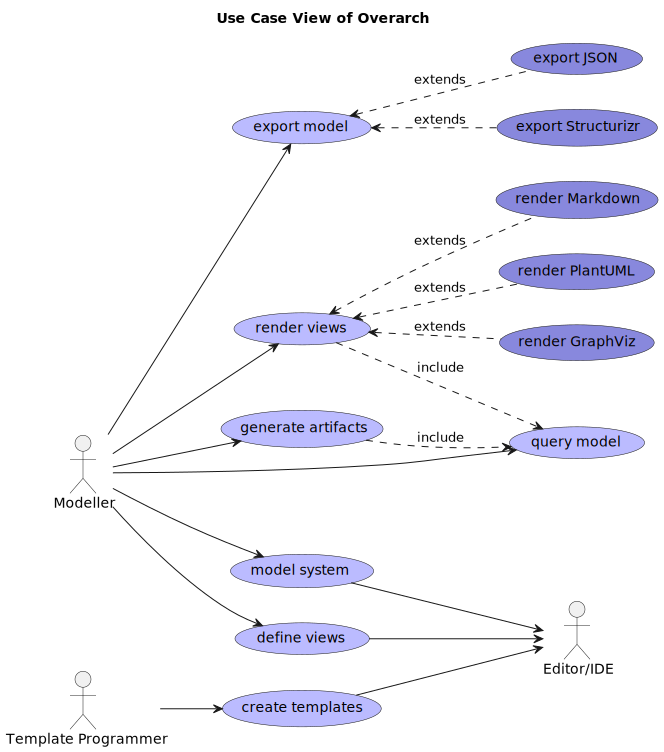

## Overarch
### Data Driven System Modelling
### Ludger Solbach


---
<!-- paginate: true -->
<!-- header: "overarch - data driven modelling" -->
<!-- footer: "Ludger Solbach" -->

# The problem

Understanding complex systems

---

# Overarch

  * lightweight open source modelling
  * data driven and text based
    -> developer friendly
  * visualization
  * queries
  * reports

---

# Rationale

System models for
* thinking
* communication
* documentation
* querying

---

# Rationale

Drawing tools
e.g. Visio, Gliffy, ExcaliDraw
 * no model, only pretty pictures
 * no reuse between diagrams

---

# Rationale

Commercial modelling tools
* e.g. Enterprise Architect, Magic Draw
* comprehensive but complex
* license needed

---

# Use Cases



---

# Models

## Elements of the system
 * concept models, concept maps and glossaries
 * system landscape and architecture, deployment
 * use cases, state machines and class models

---

# Models

## Models as data
 * hierarchical models and element references
 * composable / reusable
 * extensible

---

# Views

## Representations of the system
 * selection of model elements for a specific 
   * context
   * audience
   * level of detail

---

# Views

 * C4 views for system architecture
   * system context, container, component
   * deployment, system landscape, dynamic

---

# Views

## views as data
separation of models and views
view specific customization of model elements

---

# Queries

* queries as data
  * 

---

# Rendering

 * PlantUML
   * C4 views, UML views
     * use case, state machine and class diagrams
   * styling and sprite support
 * GraphViz
   * concept maps
 * Markdown
   * glossaries
   * textual representations of graphical views

---

# Exporting

* exports
  * JSON if you need to process models with languages without EDN support
  * Structurizr *experimental*

---

# Example Model


---

# Example View


---

# Example Diagram


---

# Example Diagram


---

# Extensible Data Notation (EDN)

Similar to JSON but richer set of data literals
Subset of Clojure

---

# EDN - Primitives

Numbers: ```123```
Strings: ```"Hello"```
Keywords: ```:keyword```, ```:namespaced/keyword```

---

# EDN - Data Structures

Vectors: ```["a" "b" "c"]```
Sets: ```#{"a" "b" "c"}```
Maps: ```{:a "a" :b "b" :c "c"}```

Data structures can be nested

---

# Modelling Example
```clojure
#{ ; set of model elements
  {:el :system
   :id :example/system1
   :name "Example System"
   :desc "An example system to show how to model in overarch"
   :ct #{ ; set of children
         {:el :container
          :id :example/container1
          :name "Example Container"
          :tech "Java"
          :desc "Deployable application in the example system"}}}
...
}
```

---

# Modelling Methods

**C4 Model**: Architecture Model, Deployment Model, Dynamic Model
**UML**: Use Case Model, Class Model, State Machines
**Concept Maps**: Concept Model

---

# Architecture Model

#### Elements
:person :system :container :component
:enterprise-boundary :context-boundary

#### Relations
:request :response :publish :subscribe
:send :dataflow :rel

---

# Deployment Model

#### Elements
:node :system :container

#### Relations
:deployed-to :link :rel

---

# Class Model

#### Elements
:package :interface :class :field :method
  :enum :enum-value :stereotype :annotation :namespace :function :protocol 
    
#### Relations
:inheritance :implementation :composition :aggregation :association :dependency

---

# Use Case Model

#### Elements
:use-case :actor :person :system :context-boundary

#### Relations
:uses :include :extends :generalizes

---

# State Machine

#### Elements
:state-machine :start-state :state :end-state :fork :join
:choice :history-state :deep-history-state

#### Relations
:transition

---

# Concept Model

#### Elements
:concept :person :system :container
:enterprise-boundary :context-boundary

#### Relations
:is-a :has :rel

---
# Artifact Generation
* template based
* reports
* project scaffolding
* code

---

# Model Queries
#### Element Selection by Criteria
* dynamic views 
* 

---

# Model Queries

#### Selection by Criteria

Criteria map:
  {:namespace "banking" :el container}
Vector of maps:
  [{:namespace "banking" :el :container} {:namespace "banking" :el :request}]

---

# Views

Views define
 * which model elements rendered
 * how the model elements are rendered

---

# Rendering

PlantUML: C4 Views, UML Views
Graphviz: Concept Maps
Markdown: Glossary

---

# Export

JSON: complete model

Structurizr: architecture/deployment model and views only

EDN: (work in progress)

---

# Command Line Interface

Overarch CLI


---


