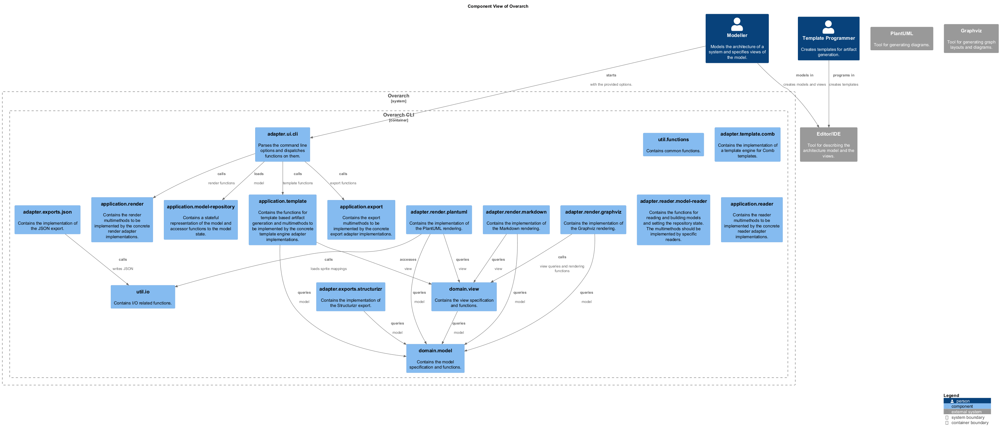

# Component View of Overarch

## Diagram

## Description

## Roles
| Person/Role | Description |
|---|---|
| [Modeller](../../overarch/roles/modeller.md)| Models the architecture of a system and specifies views of the model. |
| [Template Programmer](../../overarch/roles/template-programmer.md)| Creates templates for artifact generation. |

## Systems
| System | Description |
|---|---|
| [Editor/IDE](../../overarch/architecture/editor.md)| Tool for describing the architecture model and the views. |
| [Graphviz](../../overarch/architecture/graphviz.md)| Tool for generating graph layouts and diagrams. |
| [Overarch](../../overarch/architecture/overarch.md)| An Open Architecture Knowledge Platform |
| [PlantUML](../../overarch/architecture/plantuml.md)| Tool for generating diagrams. |

## Containers
| Container | Description |
|---|---|
| [Overarch CLI](../../overarch/architecture/overarch-cli.md)| CLI tool for the generation of value from the knowledge. |

## Components
| Component | Description |
|---|---|
| [adapter.exports.json](../../overarch/adapter/exports/json.md)| Contains the implementation of the JSON export. |
| [adapter.exports.structurizr](../../overarch/adapter/exports/structurizr.md)| Contains the implementation of the Structurizr export. |
| [adapter.reader.model-reader](../../overarch/adapter/reader/model-reader.md)| Contains the functions for reading and building models and setting the repository state. The multimethods should be implemented by specific readers. |
| [adapter.render.graphviz](../../overarch/adapter/render/graphviz.md)| Contains the implementation of the Graphviz rendering. |
| [adapter.render.markdown](../../overarch/adapter/render/markdown.md)| Contains the implementation of the Markdown rendering. |
| [adapter.render.plantuml](../../overarch/adapter/render/plantuml.md)| Contains the implementation of the PlantUML rendering. |
| [adapter.template.comb](../../overarch/adapter/template/comb.md)| Contains the implementation of a template engine for Comb templates. |
| [adapter.ui.cli](../../overarch/adapter/ui/cli.md)| Parses the command line options and dispatches functions on them. |
| [application.export](../../overarch/application/export.md)| Contains the export multimethods to be implemented by the concrete export adapter implementations. |
| [application.model-repository](../../overarch/application/model-repository.md)| Contains a stateful representation of the model and accessor functions to the model state. |
| [application.reader](../../overarch/application/reader.md)| Contains the reader multimethods to be implemented by the concrete reader adapter implementations. |
| [application.render](../../overarch/application/render.md)| Contains the render multimethods to be implemented by the concrete render adapter implementations. |
| [application.template](../../overarch/application/template.md)| Contains the functions for template based artifact generation and multimethods to be implemented by the concrete template engine adapter implementations. |
| [domain.model](../../overarch/domain/model.md)| Contains the model specification and functions. |
| [domain.view](../../overarch/domain/view.md)| Contains the view specification and functions. |
| [util.functions](../../overarch/util/functions.md)| Contains common functions. |
| [util.io](../../overarch/util/io.md)| Contains I/O related functions. |

## Synchronous Requests
| From | Name | To | Technology | Description |
|---|---|---|---|---|
| [adapter.render.markdown](../../overarch/adapter/render/markdown.md) |  queries | [domain.view](../../overarch/domain/view.md) |  | view |
| [application.template](../../overarch/application/template.md) | accesses | [domain.view](../../overarch/domain/view.md) |  | view |
| [adapter.ui.cli](../../overarch/adapter/ui/cli.md) | calls | [application.export](../../overarch/application/export.md) |  | export functions |
| [adapter.render.plantuml](../../overarch/adapter/render/plantuml.md) | calls | [util.io](../../overarch/util/io.md) |  | loads sprite mappings |
| [adapter.ui.cli](../../overarch/adapter/ui/cli.md) | calls | [application.template](../../overarch/application/template.md) |  | template functions |
| [adapter.render.graphviz](../../overarch/adapter/render/graphviz.md) | calls | [domain.view](../../overarch/domain/view.md) |  | view queries and rendering functions |
| [adapter.ui.cli](../../overarch/adapter/ui/cli.md) | calls | [application.render](../../overarch/application/render.md) |  | render functions |
| [adapter.exports.json](../../overarch/adapter/exports/json.md) | calls | [util.io](../../overarch/util/io.md) |  | writes JSON |
| [adapter.ui.cli](../../overarch/adapter/ui/cli.md) | loads | [application.model-repository](../../overarch/application/model-repository.md) |  | model |
| [Modeller](../../overarch/roles/modeller.md) | models in | [Editor/IDE](../../overarch/architecture/editor.md) |  | creates models and views |
| [Template Programmer](../../overarch/roles/template-programmer.md) | programs in | [Editor/IDE](../../overarch/architecture/editor.md) |  | creates templates |
| [adapter.exports.structurizr](../../overarch/adapter/exports/structurizr.md) | queries | [domain.model](../../overarch/domain/model.md) |  | model |
| [adapter.render.markdown](../../overarch/adapter/render/markdown.md) | queries | [domain.model](../../overarch/domain/model.md) |  | model |
| [adapter.render.plantuml](../../overarch/adapter/render/plantuml.md) | queries | [domain.view](../../overarch/domain/view.md) |  | view |
| [application.template](../../overarch/application/template.md) | queries | [domain.model](../../overarch/domain/model.md) |  | model |
| [adapter.render.graphviz](../../overarch/adapter/render/graphviz.md) | queries | [domain.model](../../overarch/domain/model.md) |  | model |
| [domain.view](../../overarch/domain/view.md) | queries | [domain.model](../../overarch/domain/model.md) |  | model |
| [adapter.render.plantuml](../../overarch/adapter/render/plantuml.md) | queries | [domain.model](../../overarch/domain/model.md) |  | model |

## Other Relationships
| From | Name | To | Description |
|---|---|---|---|
| [Modeller](../../overarch/roles/modeller.md) | starts | [adapter.ui.cli](../../overarch/adapter/ui/cli.md) | with the provided options. |

## Navigation
[List of views in namespace](./views-in-namespace.md)

[List of all Views](../../views.md)

(generated by [Overarch](https://github.com/soulspace-org/overarch) with template docs/view.md.cmb)

