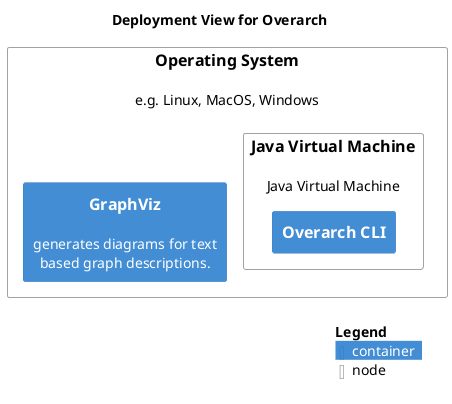

# Deployment View for Overarch

## Diagram

## Description
Shows the deployment of overarch.

## Deployment Nodes
| Node | Description |
|---|---|
| [Operating System](../../overarch/deployment/os.md)| e.g. Linux, MacOS, Windows |

## Navigation
[List of views in namespace](./views-in-namespace.md)

[List of all Views](../../views.md)

(generated by [Overarch](https://github.com/soulspace-org/overarch) with template docs/view.md.cmb)

