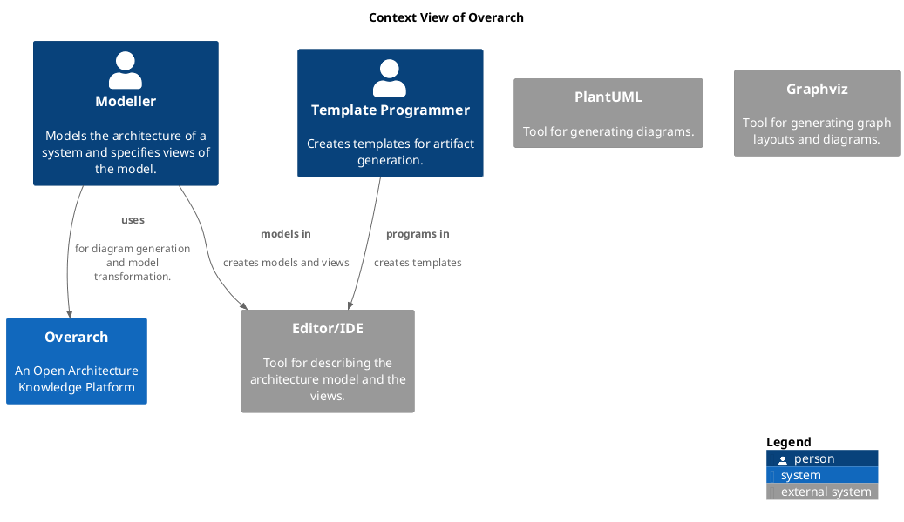

# Editor/IDE (System)
## Description
Tool for describing the architecture model and the views.

## Actors
| Actor | Description |
|---|---|
| [create templates](../../overarch/use-case/create-templates.md) | Create templates to generate artifacts from model selections. |
| [define views](../../overarch/use-case/define-views.md) | Textually define views of the system in the Overarch view model. |
| [model system](../../overarch/use-case/model-system.md) | Textually model the system in the Overarch data model. |
## Incoming Synchronous Requests 
| From | Name | To | Technology | Description |
|---|---|---|---|---|
| [Modeller](../../overarch/roles/modeller.md) | models in | [Editor/IDE](../../overarch/architecture/editor.md) |  | creates models and views |
| [Template Programmer](../../overarch/roles/template-programmer.md) | programs in | [Editor/IDE](../../overarch/architecture/editor.md) |  | creates templates |

## System Context View

[Context View of Overarch](../../overarch/architecture/context-view.md)

## System Structure
[System Structure View of Overarch](../../overarch/architecture/system-structure-view.md)

## Navigation
[List of views in namespace](./views-in-namespace.md)

[List of all Views](../../views.md)

(generated by [Overarch](https://github.com/soulspace-org/overarch) with template docs/node.md.cmb)
