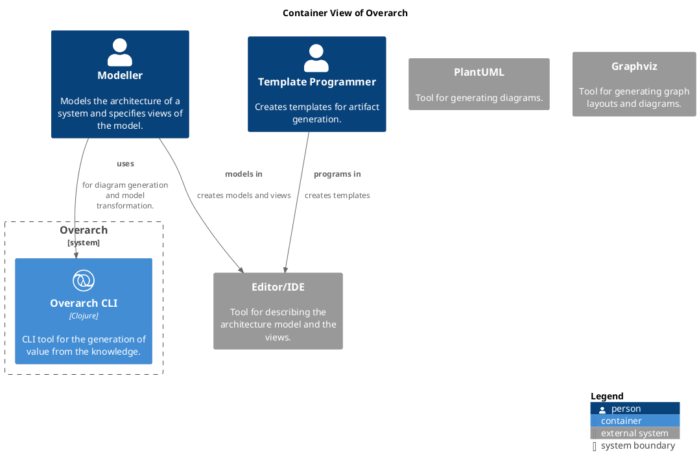

# Architecture Documentation for Overarch
An Open Architecture Knowledge Platform

## Table of Content
1. [Introduction and Goals](#introduction-and-goals)
1. [Architecture Constraints](#architecture-constraints)
1. [System Context and Scope](#system-context-and-scope)
1. [Solution Strategy](#solution-strategy)
1. [Building Block View](#building-blocks)
1. [Runtime View](#runtime-view)
1. [Deployment View](#deployment-view)
1. [Crosscutting Concepts](#crosscutting-concepts)
1. [Architectural Decisions](#architecture-decisions)
1. [Quality Requirements](#quality-requirements)
1. [Risk and Technical Dept](#risk-and-technical-dept)

## Introduction and Goals
<!-- PA-BEGIN(Introduction1) -->
Overarch is an open architecture knowledge platform.
It captures (architecture) knowledge in a graph based knowledge model.
This knowledge model can be queried to answer architectural questions.
<!-- PA-END(Introduction1) -->

### Goals
| Goal | Description |
|---|---|
| [Composeable Models](../../overarch/architecture/goal/composeable-models.md) | Models from different sources can be composed to form a larger model. |
| [Customizable Scopes](../../overarch/architecture/goal/customizable-model-scopes.md) | The scope of the viewpoints on the model is selectable. |
| [Customizable View Specifications](../../overarch/architecture/goal/customizable-view-specifications.md) | The viewpoints on the model are fully customizable. |
| [Extensible Models](../../overarch/architecture/goal/extensible-model-elements.md) | Model elements are open and can be extended with additional information. |
| [Open Architecture Knowledge Platform](../../overarch/architecture/goal/knowledge-models.md) | An Overarch model shall capture architectural knowledge on different levels (e.g. enterprise, business, system, code, deployment). |
| [Open Models](../../overarch/architecture/goal/open-models.md) | The knowledge captured in the models shall be open and accessible for other tools |
| [Queryable Models](../../overarch/architecture/goal/queryably-models.md) | Model can be queried to answer specific questions or to select a specific subset of the model. |
| [Template-based Artifact Generation](../../overarch/architecture/goal/template-based-artifact-generation.md) | The generation of artifacts from the model is fully customizeable via templates. |

<!-- PA-BEGIN(Introduction2) -->
<!-- PA-END(Introduction2) -->

## Architecture Constraints
<!-- PA-BEGIN(ArchitectureConstraints1) -->
<!-- PA-END(ArchitectureConstraints1) -->

<!-- PA-BEGIN(ArchitectureConstraints2) -->
<!-- PA-END(ArchitectureConstraints2) -->

## System Context and Scope
<!-- PA-BEGIN(SystemContext1) -->
<!-- PA-END(SystemContext1) -->

### System Context View

[Context View of Overarch](../../overarch/architecture/context-view.md)

<!-- PA-BEGIN(SystemContext1) -->
<!-- PA-END(SystemContext1) -->

### Scope
<!-- PA-BEGIN(Scope) -->
<!-- PA-END(Scope) -->

## Solution Strategy
<!-- PA-BEGIN(SolutionStrategy) -->
* Capture knowledge model in text files
* Leverage version control (e.g. git) for
  * versioning
  * resolving merge conflicts
* Leverage text based diagram tools (e.g. PlantUML or GraphViz) for visualization
* Use templates for rendering viewpoints
<!-- PA-END(SolutionStrategy) -->

## Building Blocks
<!-- PA-BEGIN(BuildingBlocks1) -->
<!-- PA-END(BuildingBlocks1) -->

### Container View

[Container View of Overarch](../../overarch/architecture/container-view.md)

<!-- PA-BEGIN(BuildingBlocks2) -->
<!-- PA-END(BuildingBlocks2) -->

## Runtime View
<!-- PA-BEGIN(RuntimeView) -->
<!-- PA-END(RuntimeView) -->

## Deployment View
<!-- PA-BEGIN(DeploymentView1) -->
<!-- PA-END(DeploymentView1) -->

<!-- PA-BEGIN(DeploymentView2) -->
<!-- PA-END(DeploymentView2) -->

## Crosscutting Concepts
<!-- PA-BEGIN(CrosscuttingConcepts) -->
<!-- PA-END(CrosscuttingConcepts) -->

## Architecture Decisions
<!-- PA-BEGIN(ArchitectureDecisions1) -->
<!-- PA-END(ArchitectureDecisions1) -->

### Decisions
| Decision | Description |
|---|---|
| [Data Format for Models](../../overarch/architecture/decision/data-format.md) | Extensible Data Notation (EDN) is used as the data format for models and other customization/configuration data |
| [Implementation Architecture](../../overarch/architecture/decision/implementation-architecture.md) | Clean Architecture is used to structure the implementation |
| [Implementation Language](../../overarch/architecture/decision/implementation-language.md) | Clojure is used as sole implementation language |
| [Internal Data Representation](../../overarch/architecture/decision/data-representation.md) | Model elements are stored in a graph of nodes and relations |

<!-- PA-BEGIN(ArchitectureDecisions2) -->
<!-- PA-END(ArchitectureDecisions2) -->

## Quality Requirements
<!-- PA-BEGIN(QualityRequirements1) -->
<!-- PA-END(QualityRequirements1) -->

<!-- PA-BEGIN(QualityRequirements2) -->
<!-- PA-END(QualityRequirements2) -->

## Risk and Technical Dept
### Risks
<!-- PA-BEGIN(Risk1) -->
<!-- PA-END(Risk1) -->

<!-- PA-BEGIN(Risk2) -->
<!-- PA-END(Risk2) -->

### Technical Dept
<!-- PA-BEGIN(TechnicalDept) -->
<!-- PA-END(TechnicalDept) -->

