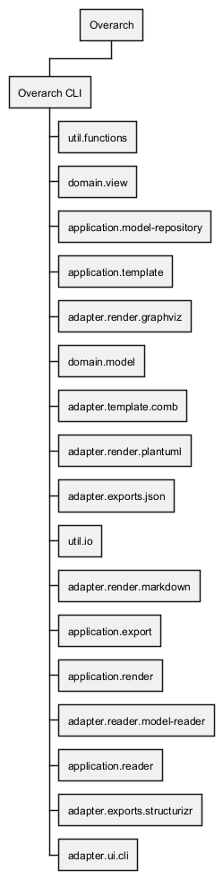

# System Structure View of Overarch

## Diagram

## Description
Shows the structure of the Overarch systems.

## Systems
| System | Description |
|---|---|
| [Overarch](../../overarch/architecture/overarch.md)| An Open Architecture Knowledge Platform |

## Containers
| Container | Description |
|---|---|
| [Overarch CLI](../../overarch/architecture/overarch-cli.md)| CLI tool for the generation of value from the knowledge. |

## Components
| Component | Description |
|---|---|
| [adapter.exports.json](../../overarch/adapter/exports/json.md)| Contains the implementation of the JSON export. |
| [adapter.exports.structurizr](../../overarch/adapter/exports/structurizr.md)| Contains the implementation of the Structurizr export. |
| [adapter.reader.model-reader](../../overarch/adapter/reader/model-reader.md)| Contains the functions for reading and building models and setting the repository state. The multimethods should be implemented by specific readers. |
| [adapter.render.graphviz](../../overarch/adapter/render/graphviz.md)| Contains the implementation of the Graphviz rendering. |
| [adapter.render.markdown](../../overarch/adapter/render/markdown.md)| Contains the implementation of the Markdown rendering. |
| [adapter.render.plantuml](../../overarch/adapter/render/plantuml.md)| Contains the implementation of the PlantUML rendering. |
| [adapter.template.comb](../../overarch/adapter/template/comb.md)| Contains the implementation of a template engine for Comb templates. |
| [adapter.ui.cli](../../overarch/adapter/ui/cli.md)| Parses the command line options and dispatches functions on them. |
| [application.export](../../overarch/application/export.md)| Contains the export multimethods to be implemented by the concrete export adapter implementations. |
| [application.model-repository](../../overarch/application/model-repository.md)| Contains a stateful representation of the model and accessor functions to the model state. |
| [application.reader](../../overarch/application/reader.md)| Contains the reader multimethods to be implemented by the concrete reader adapter implementations. |
| [application.render](../../overarch/application/render.md)| Contains the render multimethods to be implemented by the concrete render adapter implementations. |
| [application.template](../../overarch/application/template.md)| Contains the functions for template based artifact generation and multimethods to be implemented by the concrete template engine adapter implementations. |
| [domain.model](../../overarch/domain/model.md)| Contains the model specification and functions. |
| [domain.view](../../overarch/domain/view.md)| Contains the view specification and functions. |
| [util.functions](../../overarch/util/functions.md)| Contains common functions. |
| [util.io](../../overarch/util/io.md)| Contains I/O related functions. |

## Synchronous Requests
| From | Name | To | Technology | Description |
|---|---|---|---|---|
| [adapter.render.markdown](../../overarch/adapter/render/markdown.md) |  queries | [domain.view](../../overarch/domain/view.md) |  | view |
| [application.template](../../overarch/application/template.md) | accesses | [domain.view](../../overarch/domain/view.md) |  | view |
| [adapter.ui.cli](../../overarch/adapter/ui/cli.md) | calls | [application.export](../../overarch/application/export.md) |  | export functions |
| [adapter.render.plantuml](../../overarch/adapter/render/plantuml.md) | calls | [util.io](../../overarch/util/io.md) |  | loads sprite mappings |
| [adapter.ui.cli](../../overarch/adapter/ui/cli.md) | calls | [application.template](../../overarch/application/template.md) |  | template functions |
| [adapter.render.graphviz](../../overarch/adapter/render/graphviz.md) | calls | [domain.view](../../overarch/domain/view.md) |  | view queries and rendering functions |
| [adapter.ui.cli](../../overarch/adapter/ui/cli.md) | calls | [application.render](../../overarch/application/render.md) |  | render functions |
| [adapter.exports.json](../../overarch/adapter/exports/json.md) | calls | [util.io](../../overarch/util/io.md) |  | writes JSON |
| [adapter.ui.cli](../../overarch/adapter/ui/cli.md) | loads | [application.model-repository](../../overarch/application/model-repository.md) |  | model |
| [adapter.exports.structurizr](../../overarch/adapter/exports/structurizr.md) | queries | [domain.model](../../overarch/domain/model.md) |  | model |
| [adapter.render.markdown](../../overarch/adapter/render/markdown.md) | queries | [domain.model](../../overarch/domain/model.md) |  | model |
| [adapter.render.plantuml](../../overarch/adapter/render/plantuml.md) | queries | [domain.view](../../overarch/domain/view.md) |  | view |
| [application.template](../../overarch/application/template.md) | queries | [domain.model](../../overarch/domain/model.md) |  | model |
| [adapter.render.graphviz](../../overarch/adapter/render/graphviz.md) | queries | [domain.model](../../overarch/domain/model.md) |  | model |
| [domain.view](../../overarch/domain/view.md) | queries | [domain.model](../../overarch/domain/model.md) |  | model |
| [adapter.render.plantuml](../../overarch/adapter/render/plantuml.md) | queries | [domain.model](../../overarch/domain/model.md) |  | model |
| [Modeller](../../overarch/roles/modeller.md) | uses | [Overarch](../../overarch/architecture/overarch.md) |  | for diagram generation and model transformation. |

## Other Relationships
| From | Name | To | Description |
|---|---|---|---|
| [Bounded Context](../../overarch/concepts/bounded-context.md) | contains | [Aggregate](../../overarch/concepts/aggregate.md) | aggregates contained in the bounded context |
| [Container](../../overarch/concepts/container.md) | deployed on | [Node](../../overarch/concepts/node.md) |  |
| [Use Case](../../overarch/concepts/use-case.md) | extends | [Use Case](../../overarch/concepts/use-case.md) | describes the extension of the functionality of the referred use case |
| [Class](../../overarch/concepts/class.md) | implementation | [Interface](../../overarch/concepts/interface.md) |  |
| [Technical Architecture Node](../../overarch/concepts/technical-architecture-node.md) | implements | [Decision](../../overarch/concepts/decision.md) |  |
| [Technical Architecture Node](../../overarch/concepts/technical-architecture-node.md) | implements | [Requirement](../../overarch/concepts/requirement.md) |  |
| [Technical Architecture Node](../../overarch/concepts/technical-architecture-node.md) | implements | [Process](../../overarch/concepts/process.md) |  |
| [Technical Architecture Node](../../overarch/concepts/technical-architecture-node.md) | implements | [Use Case](../../overarch/concepts/use-case.md) |  |
| [Technical Architecture Node](../../overarch/concepts/technical-architecture-node.md) | implements | [State Machine](../../overarch/concepts/state-machine.md) |  |
| [Use Case](../../overarch/concepts/use-case.md) | includes | [Use Case](../../overarch/concepts/use-case.md) | describes the inclusion of the functionality of the referred use case |
| [Class](../../overarch/concepts/class.md) | inheritance | [Class](../../overarch/concepts/class.md) |  |
| [Artifact](../../overarch/concepts/artifact.md) | input of | [Process](../../overarch/concepts/process.md) | artifact required by the process |
| [Node](../../overarch/concepts/node.md) | link | [Node](../../overarch/concepts/node.md) |  |
| [Artifact](../../overarch/concepts/artifact.md) | output of | [Process](../../overarch/concepts/process.md) | artifact produced by the process |
| [Information](../../overarch/concepts/information.md) | output of | [Process](../../overarch/concepts/process.md) | information produced by the process |
| [Person](../../overarch/concepts/person.md) | request | [Technical Architecture Node](../../overarch/concepts/technical-architecture-node.md) |  |
| [Knowledge](../../overarch/concepts/knowledge.md) | required | [Person](../../overarch/concepts/person.md) | knowledge required for a role |
| [Process](../../overarch/concepts/process.md) | required for | [Capability](../../overarch/concepts/capability.md) | process required for the capability |
| [Knowledge](../../overarch/concepts/knowledge.md) | required for | [Capability](../../overarch/concepts/capability.md) | knowledge required for the capability |
| [Technical Architecture Node](../../overarch/concepts/technical-architecture-node.md) | required for | [Capability](../../overarch/concepts/capability.md) | technical component required for the capability |
| [Information](../../overarch/concepts/information.md) | required for | [Process](../../overarch/concepts/process.md) | information required to fullfill the process |
| [Information](../../overarch/concepts/information.md) | required for | [Knowledge](../../overarch/concepts/knowledge.md) | information required to gain knowledge |
| [Organizational Unit](../../overarch/concepts/org-unit.md) | responsible for | [Capability](../../overarch/concepts/capability.md) | organizational unit responsible for the capability |
| [Organizational Unit](../../overarch/concepts/org-unit.md) | responsible for | [Technical Architecture Node](../../overarch/concepts/technical-architecture-node.md) | organizational unit responsible for the technical architecture node (system, container, component) |
| [Person](../../overarch/concepts/person.md) | role in | [Organizational Unit](../../overarch/concepts/org-unit.md) | role in the organizational unit |
| [Person](../../overarch/concepts/person.md) | role in | [Process](../../overarch/concepts/process.md) | personal role in a process |
| [Modeller](../../overarch/roles/modeller.md) | starts | [adapter.ui.cli](../../overarch/adapter/ui/cli.md) | with the provided options. |
| [State](../../overarch/concepts/state.md) | transition | [State](../../overarch/concepts/state.md) | describes the transition fom one state to another state triggered by an event |
| [Domain Event](../../overarch/concepts/domain-event.md) | triggers | [Policy](../../overarch/concepts/policy.md) | policy triggered by the domain event |
| [Policy](../../overarch/concepts/policy.md) | triggers | [Command](../../overarch/concepts/command.md) | command triggered by the policy |
| [Actor](../../overarch/concepts/actor.md) | uses | [Use Case](../../overarch/concepts/use-case.md) | describes the goal or usage of the use case by an actor |
| [Version](../../overarch/concepts/version.md) | version of | [Artifact](../../overarch/concepts/artifact.md) | version of an artifact |

## Navigation
[List of views in namespace](./views-in-namespace.md)

[List of all Views](../../views.md)

(generated by [Overarch](https://github.com/soulspace-org/overarch) with template docs/view.md.cmb)

