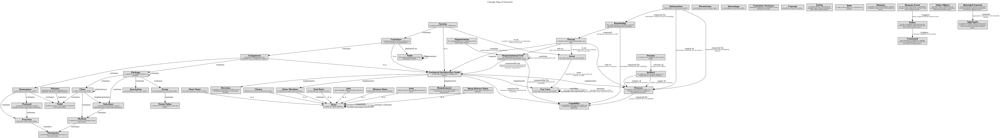

# Package (Concept)
## Description
A collection of related classes or modules.

## Features
| Concept | Description |
|---|---|
| [Annotation](../../overarch/concepts/annotation.md) | An annotation in the code model. |
| [Class](../../overarch/concepts/class.md) | A class in the code model. |
| [Enum](../../overarch/concepts/enum.md) | An enumeration in the code model. |
| [Interface](../../overarch/concepts/interface.md) | A contract that defines a set of operations that a class must implement. |
| [Package](../../overarch/concepts/package.md) | A collection of related classes or modules. |
## Feature of
| Concept | Description |
|---|---|
| [Component](../../overarch/concepts/component.md) | A (logical) building block of a container (e.g. a module or a layer) |
| [Package](../../overarch/concepts/package.md) | A collection of related classes or modules. |

## Concept Map

[Concept Map of Overarch](../../overarch/concepts/concept-view.md)

## Navigation
[List of views in namespace](./views-in-namespace.md)

[List of all Views](../../views.md)

(generated by [Overarch](https://github.com/soulspace-org/overarch) with template docs/node.md.cmb)
