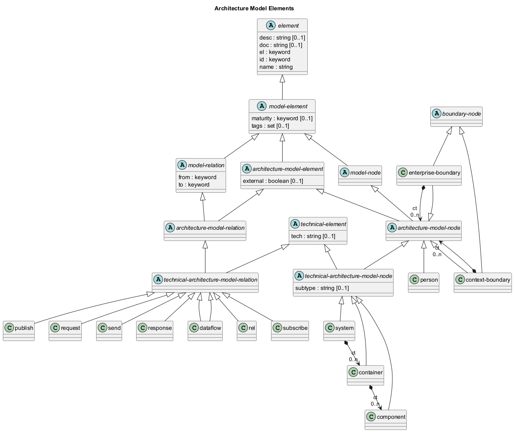

# Architecture Model Elements

## Diagram

## Description
Shows the logical hierarchy of the architecture model elements

## Classes
| Class | Description |
|---|---|
| [architecture-model-element](../../overarch/data-model/architecture-model-element.md)| An element of the architecture model. |
| [architecture-model-node](../../overarch/data-model/architecture-model-node.md)| A node in the architecture model. |
| [architecture-model-relation](../../overarch/data-model/architecture-model-relation.md)| A relation in the architecture model. |
| [boundary-node](../../overarch/data-model/boundary-node.md)| A grouping of elements belonging together in a context. |
| [component](../../overarch/data-model/component.md)| A compontent is a part of a container and describes a (logical) building block of a container (e.g. a module or a layer). |
| [container](../../overarch/data-model/container.md)| A container is a part of a system and describes a deployed process in the architecture (e.g. a service or an application). A container is a compound element which contains the components of the implementation. A container can be used in the architecture model, the deployment model and the use case model. |
| [context-boundary](../../overarch/data-model/context-boundary.md)| A boundary of a bounded context. |
| [dataflow](../../overarch/data-model/dataflow.md)| A flow of data between two elements of the architecture. |
| [element](../../overarch/data-model/element.md)| An element of data. |
| [enterprise-boundary](../../overarch/data-model/enterprise-boundary.md)| A boundary of an enterprise or a company. |
| [model-element](../../overarch/data-model/model-element.md)| An element which describes the relation of elements. |
| [model-node](../../overarch/data-model/model-node.md)| An element which is a node in the model. |
| [model-relation](../../overarch/data-model/model-relation.md)| An element which is a relation in the and describes the relationship of two model nodes. |
| [person](../../overarch/data-model/person.md)| A human actor or role working with the system under description. A person can be used in the architecture model and the use case model. |
| [publish](../../overarch/data-model/publish.md)| Publishing of asynchronous events between two elements of the architecture (receiver should be a broker or topic). |
| [rel](../../overarch/data-model/rel.md)| A generic relation between the concepts. |
| [request](../../overarch/data-model/request.md)| A synchronous request between two elements of the architecture. |
| [response](../../overarch/data-model/response.md)| A response to a synchronous request between two elements of the architecture. |
| [send](../../overarch/data-model/send.md)| An asynchronous message or command between two elements of the architecture (point-to-point). |
| [subscribe](../../overarch/data-model/subscribe.md)| Subscription of asynchronous events between two elements of the architecture (sender should be a broker or topic). |
| [system](../../overarch/data-model/system.md)| A system relevant in the architecture. A system can be an external system, which is modelled as a black box or an internal system, a system under description, which is modelled as a compound element with all the containers of the system. A system can be used in the architecture model, the deployment model (external systems) and the use case model (external systems). |
| [technical-architecture-model-node](../../overarch/data-model/technical-architecture-model-node.md)| A technical node in the architecture model. |
| [technical-architecture-model-relation](../../overarch/data-model/technical-architecture-model-relation.md)| A technical relation in the architecture model. |
| [technical-element](../../overarch/data-model/technical-element.md)| An element which is implemented in the given technologies. |

## Navigation
[List of views in namespace](./views-in-namespace.md)

[List of all Views](../../views.md)

(generated by [Overarch](https://github.com/soulspace-org/overarch) with template docs/view.md.cmb)

