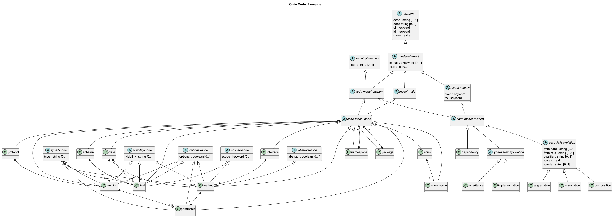

# Code Model Elements

## Diagram

## Description
Shows the logical hierarchy of the code model elements

## Classes
| Class | Description |
|---|---|
| [abstract-node](../../overarch/data-model/abstract-node.md)| A node which may have an abstract field. |
| [aggregation](../../overarch/data-model/aggregation.md)| A aggregation relationship between two classes in the code model. |
| [association](../../overarch/data-model/association.md)| A association relationship between two classes in the code model. |
| [associative-relation](../../overarch/data-model/associative-relation.md)| A relation that may provide associative access to the referred element. |
| [class](../../overarch/data-model/class.md)| A class in the code model. |
| [code-model-element](../../overarch/data-model/code-model-element.md)| An element in a code model. |
| [code-model-node](../../overarch/data-model/code-model-node.md)| A node in the code model. |
| [code-model-relation](../../overarch/data-model/code-model-relation.md)| A relation in the code model. |
| [composition](../../overarch/data-model/composition.md)| A composition relationship between two classes in the code model. |
| [dependency](../../overarch/data-model/dependency.md)| A dependency relationship between two elements in the code model. |
| [element](../../overarch/data-model/element.md)| An element of data. |
| [enum](../../overarch/data-model/enum.md)| An enumeration of typed related values in the code model. |
| [enum-value](../../overarch/data-model/enum-value.md)| A value of an enumeration in the code model. |
| [field](../../overarch/data-model/field.md)| A field in a code model element. |
| [function](../../overarch/data-model/function.md)| A function in the code model. |
| [implementation](../../overarch/data-model/implementation.md)| An implementation relationship between a code and an interface/protocol in the class model. |
| [inheritance](../../overarch/data-model/inheritance.md)| An inheritance relationship between two classes in the code model. |
| [interface](../../overarch/data-model/interface.md)| An interface in the code model. An interface defines related methods. |
| [method](../../overarch/data-model/method.md)| A method in a code model element. |
| [model-element](../../overarch/data-model/model-element.md)| An element which describes the relation of elements. |
| [model-node](../../overarch/data-model/model-node.md)| An element which is a node in the model. |
| [model-relation](../../overarch/data-model/model-relation.md)| An element which is a relation in the and describes the relationship of two model nodes. |
| [namespace](../../overarch/data-model/namespace.md)| A namespace in the code model. Namespaces provide a hierarchical structure for the organisation of the elements of the class model. |
| [optional-node](../../overarch/data-model/optional-node.md)| A node which may have an optional field. |
| [package](../../overarch/data-model/package.md)| A package in the code model. Packages provide a hierarchical structure for the organisation of the elements of the class model. |
| [parameter](../../overarch/data-model/parameter.md)| A parameter in a code model method or function. |
| [protocol](../../overarch/data-model/protocol.md)| A protocol in the code model. A protocol defines related functions. |
| [schema](../../overarch/data-model/schema.md)| A schema in the code model. A schema defines the shape of data. |
| [scoped-node](../../overarch/data-model/scoped-node.md)| A node which may have a scope field. |
| [technical-element](../../overarch/data-model/technical-element.md)| An element which is implemented in the given technologies. |
| [type-hierarchy-relation](../../overarch/data-model/type-hierarchy-relation.md)| A relation that establishes a type hierarchy. |
| [typed-node](../../overarch/data-model/typed-node.md)| A node which may have a type field. |
| [visibility-node](../../overarch/data-model/visibility-node.md)| A node which may have a visibility field. |

## Navigation
[List of views in namespace](./views-in-namespace.md)

[List of all Views](../../views.md)

(generated by [Overarch](https://github.com/soulspace-org/overarch) with template docs/view.md.cmb)

