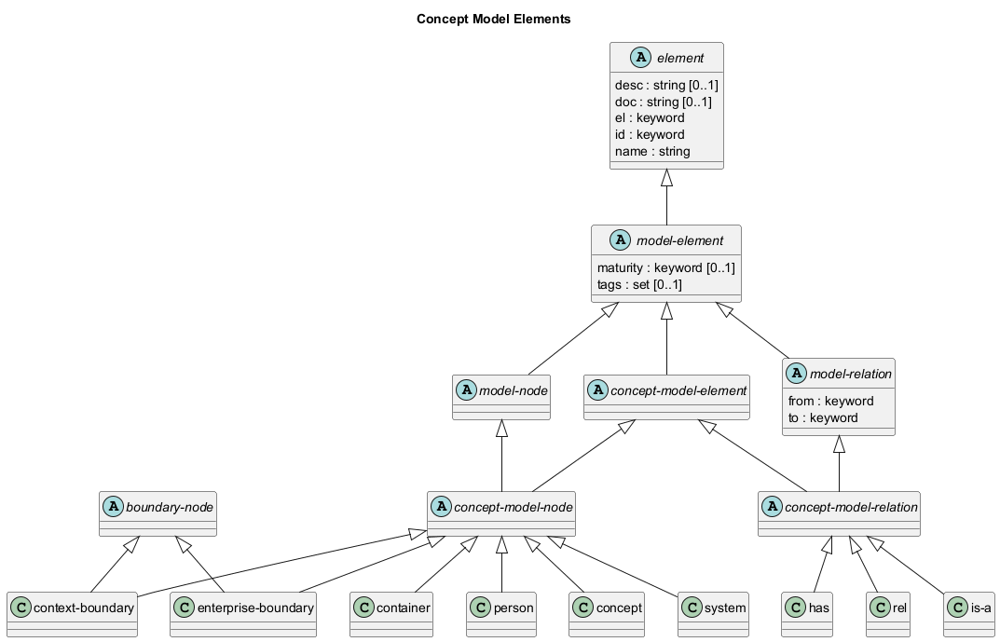

# Concept Model Elements

## Diagram

## Description
Shows the logical hierarchy of the concept model elements

## Classes
| Class | Description |
|---|---|
| [boundary-node](../../overarch/data-model/boundary-node.md)| A grouping of elements belonging together in a context. |
| [concept](../../overarch/data-model/concept.md)| A concept in the (ubiquous) language of the system. |
| [concept-model-element](../../overarch/data-model/concept-model-element.md)| An element in the concept model. |
| [concept-model-node](../../overarch/data-model/concept-model-node.md)| A node in the concept model. |
| [concept-model-relation](../../overarch/data-model/concept-model-relation.md)| A relation in the concept model. |
| [container](../../overarch/data-model/container.md)| A container is a part of a system and describes a deployed process in the architecture (e.g. a service or an application). A container is a compound element which contains the components of the implementation. A container can be used in the architecture model, the deployment model and the use case model. |
| [context-boundary](../../overarch/data-model/context-boundary.md)| A boundary of a bounded context. |
| [element](../../overarch/data-model/element.md)| An element of data. |
| [enterprise-boundary](../../overarch/data-model/enterprise-boundary.md)| A boundary of an enterprise or a company. |
| [has](../../overarch/data-model/has.md)| A composition or association relationship between the concepts. |
| [is-a](../../overarch/data-model/is-a.md)| A specialization relationship between the concepts. |
| [model-element](../../overarch/data-model/model-element.md)| An element which describes the relation of elements. |
| [model-node](../../overarch/data-model/model-node.md)| An element which is a node in the model. |
| [model-relation](../../overarch/data-model/model-relation.md)| An element which is a relation in the and describes the relationship of two model nodes. |
| [person](../../overarch/data-model/person.md)| A human actor or role working with the system under description. A person can be used in the architecture model and the use case model. |
| [rel](../../overarch/data-model/rel.md)| A generic relation between the concepts. |
| [system](../../overarch/data-model/system.md)| A system relevant in the architecture. A system can be an external system, which is modelled as a black box or an internal system, a system under description, which is modelled as a compound element with all the containers of the system. A system can be used in the architecture model, the deployment model (external systems) and the use case model (external systems). |

## Navigation
[List of views in namespace](./views-in-namespace.md)

[List of all Views](../../views.md)

(generated by [Overarch](https://github.com/soulspace-org/overarch) with template docs/view.md.cmb)

