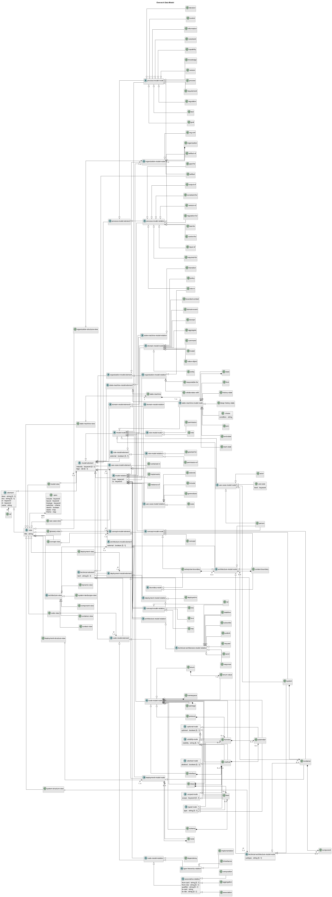

# Overarch Data Model

## Diagram

## Description
Shows the whole logical data model of Overarch

## Classes
| Class | Description |
|---|---|
| [abstract-node](../../overarch/data-model/abstract-node.md)| A node which may have an abstract field. |
| [actor](../../overarch/data-model/actor.md)| An actor (role) in a use case model. The actor can be human or technical, e.g. a system or time. If the architecture model contains persons or systems acting with the use cases, you can replace the actors with these elements. |
| [aggregate](../../overarch/data-model/aggregate.md)| A cluster of domain objects that can be treated as a single unit for consistency and invariants. Part of the solution space. |
| [aggregation](../../overarch/data-model/aggregation.md)| A aggregation relationship between two classes in the code model. |
| [architecture-model-element](../../overarch/data-model/architecture-model-element.md)| An element of the architecture model. |
| [architecture-model-node](../../overarch/data-model/architecture-model-node.md)| A node in the architecture model. |
| [architecture-model-relation](../../overarch/data-model/architecture-model-relation.md)| A relation in the architecture model. |
| [architecture-view](../../overarch/data-model/architecture-view.md)| An architectural view. |
| [artifact](../../overarch/data-model/artifact.md)| An artifact in the process model |
| [artifact-of](../../overarch/data-model/artifact-of.md)| A relation between artifacts and other process or deployment model nodes. |
| [association](../../overarch/data-model/association.md)| A association relationship between two classes in the code model. |
| [associative-relation](../../overarch/data-model/associative-relation.md)| A relation that may provide associative access to the referred element. |
| [boundary-node](../../overarch/data-model/boundary-node.md)| A grouping of elements belonging together in a context. |
| [bounded-context](../../overarch/data-model/bounded-context.md)| A boundary within which a particular domain model is valid and consistent. Part of the solution space. |
| [capability](../../overarch/data-model/capability.md)| A capability in the process model |
| [choice](../../overarch/data-model/choice.md)| A choice of transitions in a state machine. A choice has a single incoming transition and multiple outgoing transitions with the result of the condition of the choice. |
| [class](../../overarch/data-model/class.md)| A class in the code model. |
| [code-model-element](../../overarch/data-model/code-model-element.md)| An element in a code model. |
| [code-model-node](../../overarch/data-model/code-model-node.md)| A node in the code model. |
| [code-model-relation](../../overarch/data-model/code-model-relation.md)| A relation in the code model. |
| [code-view](../../overarch/data-model/code-view.md)| The code view is a static design view. It shows the code structure of some components of the system. |
| [collaborates-with](../../overarch/data-model/collaborates-with.md)| A relation between two organisational model nodes. |
| [command](../../overarch/data-model/command.md)| An instruction to perform a specific action or operation within the domain. |
| [component](../../overarch/data-model/component.md)| A compontent is a part of a container and describes a (logical) building block of a container (e.g. a module or a layer). |
| [component-view](../../overarch/data-model/component-view.md)| The component view is a static architectural view. It shows the component structure of a container and the interactions between these components and with it's environment consisting of users and external systems. |
| [composition](../../overarch/data-model/composition.md)| A composition relationship between two classes in the code model. |
| [concept](../../overarch/data-model/concept.md)| A concept in the (ubiquous) language of the system. |
| [concept-model-element](../../overarch/data-model/concept-model-element.md)| An element in the concept model. |
| [concept-model-node](../../overarch/data-model/concept-model-node.md)| A node in the concept model. |
| [concept-model-relation](../../overarch/data-model/concept-model-relation.md)| A relation in the concept model. |
| [concept-view](../../overarch/data-model/concept-view.md)| The concept view is a graphical view. It shows the concepts as a concept map with the relations between the concepts. |
| [constraint](../../overarch/data-model/constraint.md)| A constraint in the process model |
| [constraint-for](../../overarch/data-model/constraint-for.md)| A relation between constraint and other elements. |
| [contained-in](../../overarch/data-model/contained-in.md)| A composition relation from child to parent. |
| [container](../../overarch/data-model/container.md)| A container is a part of a system and describes a deployed process in the architecture (e.g. a service or an application). A container is a compound element which contains the components of the implementation. A container can be used in the architecture model, the deployment model and the use case model. |
| [container-view](../../overarch/data-model/container-view.md)| The container view is a static architectural view. It shows the process structure of the system under description and the interactions between these containers and with it's environment consisting of users and external systems. |
| [context-boundary](../../overarch/data-model/context-boundary.md)| A boundary of a bounded context. |
| [context-view](../../overarch/data-model/context-view.md)| The (system) context view is a static architectural view. It shows the system under description and the interactions with it's environment consisting of users and external systems. |
| [control](../../overarch/data-model/control.md)| A control in the process model |
| [control-for](../../overarch/data-model/control-for.md)| A relation between control and other elements. |
| [dataflow](../../overarch/data-model/dataflow.md)| A flow of data between two elements of the architecture. |
| [decision](../../overarch/data-model/decision.md)| An decision in the process model |
| [deep-history-state](../../overarch/data-model/deep-history-state.md)| A state with a deep history. |
| [dependency](../../overarch/data-model/dependency.md)| A dependency relationship between two elements in the code model. |
| [deployed-to](../../overarch/data-model/deployed-to.md)| A deployment relation between a container or an artifact and a node in the deployment model. The container or artifact is deployed to the node. |
| [deployment-model-element](../../overarch/data-model/deployment-model-element.md)| An element in the deployment model. |
| [deployment-model-node](../../overarch/data-model/deployment-model-node.md)| A node in the deployment model. |
| [deployment-model-relation](../../overarch/data-model/deployment-model-relation.md)| A relation in the deployment model. |
| [deployment-structure-view](../../overarch/data-model/deployment-structure-view.md)| The deployment structure view is a graphical view. It shows the hierarchy of the infrastructure and deployments as an organigram. |
| [deployment-view](../../overarch/data-model/deployment-view.md)| The deployment view is a static architectural view. It shows the deployment of a system with the infrastructure modelled as nodes and the containers of the system deployed in these nodes. |
| [domain](../../overarch/data-model/domain.md)| A specific area of knowledge, activity or subject matter. Part of the problem space. |
| [domain-event](../../overarch/data-model/domain-event.md)| A record of a significant event that happened in the domain that domain experts would recognize and care about. A fact in the past. |
| [domain-model-element](../../overarch/data-model/domain-model-element.md)| An element in the domain model. |
| [domain-model-node](../../overarch/data-model/domain-model-node.md)| A node in the domain model. |
| [domain-model-relation](../../overarch/data-model/domain-model-relation.md)| A relation in the domain model. |
| [dynamic-view](../../overarch/data-model/dynamic-view.md)| The dynamic view is an architectural and behavioural view. It shows the order of some interactions between elements of the architecture. |
| [element](../../overarch/data-model/element.md)| An element of data. |
| [end-state](../../overarch/data-model/end-state.md)| A end state in a state machine. |
| [enterprise-boundary](../../overarch/data-model/enterprise-boundary.md)| A boundary of an enterprise or a company. |
| [entity](../../overarch/data-model/entity.md)| An object that is defined by its identity rather than its attributes. Part of the solution space. |
| [enum](../../overarch/data-model/enum.md)| An enumeration of typed related values in the code model. |
| [enum-value](../../overarch/data-model/enum-value.md)| A value of an enumeration in the code model. |
| [extends](../../overarch/data-model/extends.md)| An extends relationship between two use cases. |
| [field](../../overarch/data-model/field.md)| A field in a code model element. |
| [fork](../../overarch/data-model/fork.md)| A fork of transitions in a state machine. A fork has a single incoming transition and multiple outgoing transitions. |
| [function](../../overarch/data-model/function.md)| A function in the code model. |
| [generalizes](../../overarch/data-model/generalizes.md)| A generalizes relationship between two use case elements. |
| [glossary-view](../../overarch/data-model/glossary-view.md)| The glossary view is a textual view. It shows the main elements and concepts of the system under description alphabetically sorted. |
| [goal](../../overarch/data-model/goal.md)| An goal in the process model |
| [goal-for](../../overarch/data-model/goal-for.md)| A relation between goal and other elements. |
| [granted-for](../../overarch/data-model/granted-for.md)| A relationship between a permission and a role. |
| [has](../../overarch/data-model/has.md)| A composition or association relationship between the concepts. |
| [history-state](../../overarch/data-model/history-state.md)| A state with history. |
| [implementation](../../overarch/data-model/implementation.md)| An implementation relationship between a code and an interface/protocol in the class model. |
| [implements](../../overarch/data-model/implements.md)| A trace relation from an implementation to its definition. |
| [include](../../overarch/data-model/include.md)| A include relationship between two use cases. |
| [information](../../overarch/data-model/information.md)| An information in the process model |
| [inheritance](../../overarch/data-model/inheritance.md)| An inheritance relationship between two classes in the code model. |
| [input-of](../../overarch/data-model/input-of.md)| A relation between artifacts, information or knowledge and processes. |
| [instance-of](../../overarch/data-model/instance-of.md)| An element is an instance of another element. |
| [interface](../../overarch/data-model/interface.md)| An interface in the code model. An interface defines related methods. |
| [is-a](../../overarch/data-model/is-a.md)| A specialization relationship between the concepts. |
| [join](../../overarch/data-model/join.md)| A join of transitions in a state machine. A join has multiple incoming transitions and a single outgoing transition. |
| [knowledge](../../overarch/data-model/knowledge.md)| A process in the process model |
| [link](../../overarch/data-model/link.md)| A link between two nodes of the deployment model. |
| [method](../../overarch/data-model/method.md)| A method in a code model element. |
| [model](../../overarch/data-model/model.md)| A representation of a domain that captures the essential aspects. Part of the solution space. |
| [model-element](../../overarch/data-model/model-element.md)| An element which describes the relation of elements. |
| [model-node](../../overarch/data-model/model-node.md)| An element which is a node in the model. |
| [model-relation](../../overarch/data-model/model-relation.md)| An element which is a relation in the and describes the relationship of two model nodes. |
| [model-view](../../overarch/data-model/model-view.md)| The model view is a graphical view. It shows all selected elements as a graph. |
| [namespace](../../overarch/data-model/namespace.md)| A namespace in the code model. Namespaces provide a hierarchical structure for the organisation of the elements of the class model. |
| [node](../../overarch/data-model/node.md)| An element of the deployment model of the system under description. A node is a compound element which contains other nodes or containers referenced from the architecture model. |
| [optional-node](../../overarch/data-model/optional-node.md)| A node which may have an optional field. |
| [org-unit](../../overarch/data-model/org-unit.md)| An organizational unit (e.g. a department) in the organization model. |
| [organization](../../overarch/data-model/organization.md)| An organization (e.g. a company) in the organization model. |
| [organization-model-element](../../overarch/data-model/organization-model-element.md)| An element in the organization model |
| [organization-model-node](../../overarch/data-model/organization-model-node.md)| A node in the organization model |
| [organization-model-relation](../../overarch/data-model/organization-model-relation.md)| A relation in the organization model |
| [organization-structure-view](../../overarch/data-model/organization-structure-view.md)| The organization structure view is a graphical view. It shows the hierarchy of the organization and its parts as an organigram. |
| [output-of](../../overarch/data-model/output-of.md)| A relation between artifacts, information or knowledge and processes. |
| [package](../../overarch/data-model/package.md)| A package in the code model. Packages provide a hierarchical structure for the organisation of the elements of the class model. |
| [parameter](../../overarch/data-model/parameter.md)| A parameter in a code model method or function. |
| [permission](../../overarch/data-model/permission.md)| A permission, entitlement or access right for some action e.g. in a system. |
| [permission-of](../../overarch/data-model/permission-of.md)| A relationship between a permission and an architecture node, e.g. a system. |
| [person](../../overarch/data-model/person.md)| A human actor or role working with the system under description. A person can be used in the architecture model and the use case model. |
| [policy](../../overarch/data-model/policy.md)| A rule or guideline that governs the behavior or actions within the domain. |
| [process](../../overarch/data-model/process.md)| A process in the process model |
| [process-model-element](../../overarch/data-model/process-model-element.md)| An element in the process model |
| [process-model-node](../../overarch/data-model/process-model-node.md)| A node in the process model |
| [process-model-relation](../../overarch/data-model/process-model-relation.md)| A relation in the process model |
| [protocol](../../overarch/data-model/protocol.md)| A protocol in the code model. A protocol defines related functions. |
| [publish](../../overarch/data-model/publish.md)| Publishing of asynchronous events between two elements of the architecture (receiver should be a broker or topic). |
| [ref](../../overarch/data-model/ref.md)| A reference to an element. |
| [regulation](../../overarch/data-model/regulation.md)| A regulation in the process model |
| [regulation-for](../../overarch/data-model/regulation-for.md)| A relation between regulation and other elements. |
| [rel](../../overarch/data-model/rel.md)| A generic relation between the concepts. |
| [request](../../overarch/data-model/request.md)| A synchronous request between two elements of the architecture. |
| [required-for](../../overarch/data-model/required-for.md)| A relation between other nodes and capabilities. |
| [requirement](../../overarch/data-model/requirement.md)| A requirement in the process model |
| [response](../../overarch/data-model/response.md)| A response to a synchronous request between two elements of the architecture. |
| [responsible-for](../../overarch/data-model/responsible-for.md)| A relation between organisational model nodes and architecture or deployment model elements. |
| [role](../../overarch/data-model/role.md)| A human actor or role working with the system under description. A person can be used in the architecture model and the use case model. |
| [role-in](../../overarch/data-model/role-in.md)| A relation between persons and organization units or processes. |
| [role-model-element](../../overarch/data-model/role-model-element.md)| An element of the role model. |
| [role-model-node](../../overarch/data-model/role-model-node.md)| A node in the role model. |
| [role-model-relation](../../overarch/data-model/role-model-relation.md)| A relation in the role model. |
| [schema](../../overarch/data-model/schema.md)| A schema in the code model. A schema defines the shape of data. |
| [scoped-node](../../overarch/data-model/scoped-node.md)| A node which may have a scope field. |
| [send](../../overarch/data-model/send.md)| An asynchronous message or command between two elements of the architecture (point-to-point). |
| [spec](../../overarch/data-model/rendering-spec.md)| A specification of the rendering options for a view. |
| [start-state](../../overarch/data-model/start-state.md)| A start state in a state machine. |
| [state](../../overarch/data-model/state.md)| A state in a state machine. |
| [state-machine](../../overarch/data-model/state-machine.md)| A state machine as root element of the state machine model. A state machine encapsulates a set of states of a system and the transitions between these states. |
| [state-machine-model-element](../../overarch/data-model/state-machine-model-element.md)| An element in a state machine model. |
| [state-machine-model-node](../../overarch/data-model/state-machine-model-node.md)| A node in the state machine model. |
| [state-machine-model-relation](../../overarch/data-model/state-machine-model-relation.md)| A relation in the state machine model. |
| [state-machine-view](../../overarch/data-model/state-machine-view.md)| The state machine view is a behavioural design view. It shows states and transitions of a state machine. |
| [subscribe](../../overarch/data-model/subscribe.md)| Subscription of asynchronous events between two elements of the architecture (sender should be a broker or topic). |
| [system](../../overarch/data-model/system.md)| A system relevant in the architecture. A system can be an external system, which is modelled as a black box or an internal system, a system under description, which is modelled as a compound element with all the containers of the system. A system can be used in the architecture model, the deployment model (external systems) and the use case model (external systems). |
| [system-landscape-view](../../overarch/data-model/system-landscape-view.md)| The system landscape view is a static architectural view. It shows the broader context of the system under description. It contains the system under descriptions, it's direct users and interacting external systems and maybe additional systems and users which play a role in the broader context of the system under description. |
| [system-structure-view](../../overarch/data-model/system-structure-view.md)| The system structure view is a graphical view. It shows the hierarchy of the system and its parts as an organigram. |
| [technical-architecture-model-node](../../overarch/data-model/technical-architecture-model-node.md)| A technical node in the architecture model. |
| [technical-architecture-model-relation](../../overarch/data-model/technical-architecture-model-relation.md)| A technical relation in the architecture model. |
| [technical-element](../../overarch/data-model/technical-element.md)| An element which is implemented in the given technologies. |
| [test](../../overarch/data-model/test.md)| A test in the process model |
| [test-for](../../overarch/data-model/test-for.md)| A relation between a test and other elements. |
| [transition](../../overarch/data-model/transition.md)| A transition from on state to another in effect of an event in the state machine. |
| [type-hierarchy-relation](../../overarch/data-model/type-hierarchy-relation.md)| A relation that establishes a type hierarchy. |
| [typed-node](../../overarch/data-model/typed-node.md)| A node which may have a type field. |
| [use-case](../../overarch/data-model/use-case.md)| A use case in the use case model. |
| [use-case-model-element](../../overarch/data-model/use-case-model-element.md)| An element in a use case model. |
| [use-case-model-node](../../overarch/data-model/use-case-model-node.md)| A node in the use case model of overarch. |
| [use-case-model-relation](../../overarch/data-model/use-case-model-relation.md)| A relation in the use case model of overarch. |
| [use-case-view](../../overarch/data-model/use-case-view.md)| The use case view is a behavioural view of the (functional) requirements. It shows the actors of the system and the use cases to provide an overview of the functionality of the system under description. |
| [uses](../../overarch/data-model/uses.md)| A use relationship between an actor and a use case (or vice versa). |
| [value-object](../../overarch/data-model/value-object.md)| An object that is defined by its attributes rather than its identity. Part of the solution space. |
| [version](../../overarch/data-model/version.md)| A version of an artifact in the process model |
| [version-of](../../overarch/data-model/version-of.md)| A relation between versions and artifacts. |
| [view](../../overarch/data-model/view.md)| An element for describing a view. |
| [visibility-node](../../overarch/data-model/visibility-node.md)| A node which may have a visibility field. |

## Navigation
[List of views in namespace](./views-in-namespace.md)

[List of all Views](../../views.md)

(generated by [Overarch](https://github.com/soulspace-org/overarch) with template docs/view.md.cmb)

