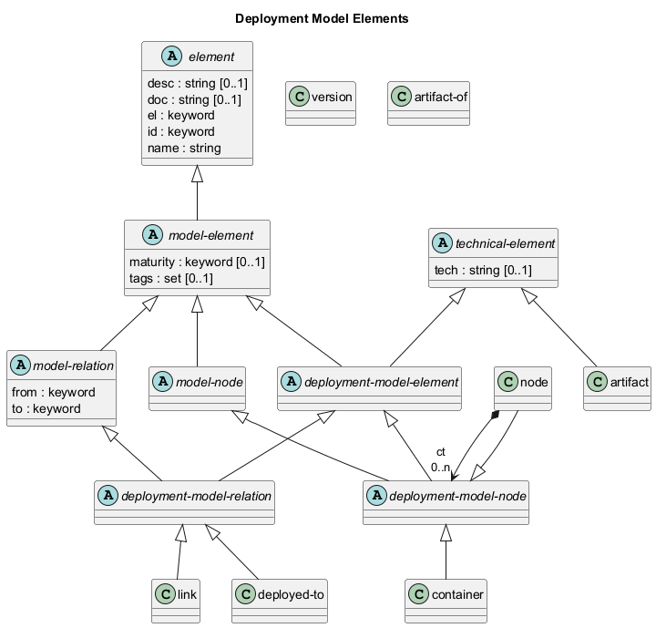

# Deployment Model Elements

## Diagram

## Description
Shows the logical hierarchy of the deployment model elements

## Classes
| Class | Description |
|---|---|
| [artifact](../../overarch/data-model/artifact.md)| An artifact in the process model |
| [artifact-of](../../overarch/data-model/artifact-of.md)| A relation between artifacts and other process or deployment model nodes. |
| [container](../../overarch/data-model/container.md)| A container is a part of a system and describes a deployed process in the architecture (e.g. a service or an application). A container is a compound element which contains the components of the implementation. A container can be used in the architecture model, the deployment model and the use case model. |
| [deployed-to](../../overarch/data-model/deployed-to.md)| A deployment relation between a container or an artifact and a node in the deployment model. The container or artifact is deployed to the node. |
| [deployment-model-element](../../overarch/data-model/deployment-model-element.md)| An element in the deployment model. |
| [deployment-model-node](../../overarch/data-model/deployment-model-node.md)| A node in the deployment model. |
| [deployment-model-relation](../../overarch/data-model/deployment-model-relation.md)| A relation in the deployment model. |
| [element](../../overarch/data-model/element.md)| An element of data. |
| [link](../../overarch/data-model/link.md)| A link between two nodes of the deployment model. |
| [model-element](../../overarch/data-model/model-element.md)| An element which describes the relation of elements. |
| [model-node](../../overarch/data-model/model-node.md)| An element which is a node in the model. |
| [model-relation](../../overarch/data-model/model-relation.md)| An element which is a relation in the and describes the relationship of two model nodes. |
| [node](../../overarch/data-model/node.md)| An element of the deployment model of the system under description. A node is a compound element which contains other nodes or containers referenced from the architecture model. |
| [technical-element](../../overarch/data-model/technical-element.md)| An element which is implemented in the given technologies. |
| [version](../../overarch/data-model/version.md)| A version of an artifact in the process model |

## Navigation
[List of views in namespace](./views-in-namespace.md)

[List of all Views](../../views.md)

(generated by [Overarch](https://github.com/soulspace-org/overarch) with template docs/view.md.cmb)

