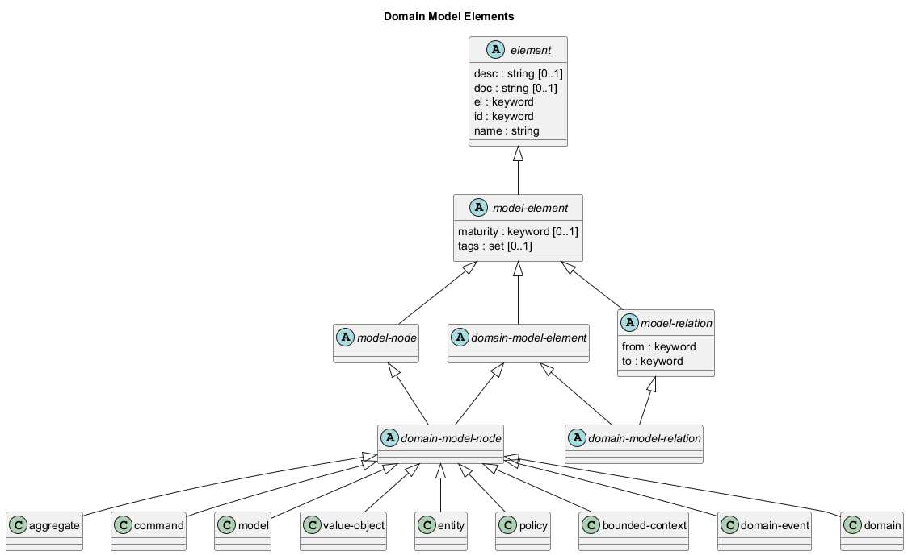

# Domain Model Elements

## Diagram

## Description
Shows the logical hierarchy of the domain model elements

## Classes
| Class | Description |
|---|---|
| [aggregate](../../overarch/data-model/aggregate.md)| A cluster of domain objects that can be treated as a single unit for consistency and invariants. Part of the solution space. |
| [bounded-context](../../overarch/data-model/bounded-context.md)| A boundary within which a particular domain model is valid and consistent. Part of the solution space. |
| [command](../../overarch/data-model/command.md)| An instruction to perform a specific action or operation within the domain. |
| [domain](../../overarch/data-model/domain.md)| A specific area of knowledge, activity or subject matter. Part of the problem space. |
| [domain-event](../../overarch/data-model/domain-event.md)| A record of a significant event that happened in the domain that domain experts would recognize and care about. A fact in the past. |
| [domain-model-element](../../overarch/data-model/domain-model-element.md)| An element in the domain model. |
| [domain-model-node](../../overarch/data-model/domain-model-node.md)| A node in the domain model. |
| [domain-model-relation](../../overarch/data-model/domain-model-relation.md)| A relation in the domain model. |
| [element](../../overarch/data-model/element.md)| An element of data. |
| [entity](../../overarch/data-model/entity.md)| An object that is defined by its identity rather than its attributes. Part of the solution space. |
| [model](../../overarch/data-model/model.md)| A representation of a domain that captures the essential aspects. Part of the solution space. |
| [model-element](../../overarch/data-model/model-element.md)| An element which describes the relation of elements. |
| [model-node](../../overarch/data-model/model-node.md)| An element which is a node in the model. |
| [model-relation](../../overarch/data-model/model-relation.md)| An element which is a relation in the and describes the relationship of two model nodes. |
| [policy](../../overarch/data-model/policy.md)| A rule or guideline that governs the behavior or actions within the domain. |
| [value-object](../../overarch/data-model/value-object.md)| An object that is defined by its attributes rather than its identity. Part of the solution space. |

## Navigation
[List of views in namespace](./views-in-namespace.md)

[List of all Views](../../views.md)

(generated by [Overarch](https://github.com/soulspace-org/overarch) with template docs/view.md.cmb)

