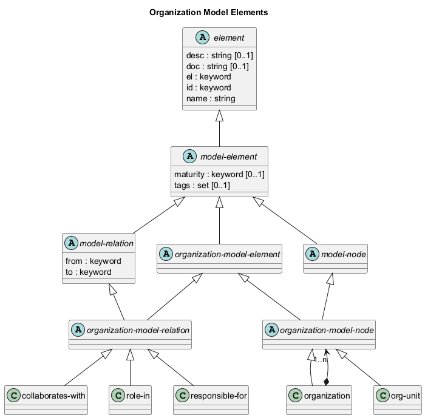

# Organization Model Elements

## Diagram

## Description
Shows the logical hierarchy of the organization model elements

## Classes
| Class | Description |
|---|---|
| [collaborates-with](../../overarch/data-model/collaborates-with.md)| A relation between two organisational model nodes. |
| [element](../../overarch/data-model/element.md)| An element of data. |
| [model-element](../../overarch/data-model/model-element.md)| An element which describes the relation of elements. |
| [model-node](../../overarch/data-model/model-node.md)| An element which is a node in the model. |
| [model-relation](../../overarch/data-model/model-relation.md)| An element which is a relation in the and describes the relationship of two model nodes. |
| [org-unit](../../overarch/data-model/org-unit.md)| An organizational unit (e.g. a department) in the organization model. |
| [organization](../../overarch/data-model/organization.md)| An organization (e.g. a company) in the organization model. |
| [organization-model-element](../../overarch/data-model/organization-model-element.md)| An element in the organization model |
| [organization-model-node](../../overarch/data-model/organization-model-node.md)| A node in the organization model |
| [organization-model-relation](../../overarch/data-model/organization-model-relation.md)| A relation in the organization model |
| [responsible-for](../../overarch/data-model/responsible-for.md)| A relation between organisational model nodes and architecture or deployment model elements. |
| [role-in](../../overarch/data-model/role-in.md)| A relation between persons and organization units or processes. |

## Navigation
[List of views in namespace](./views-in-namespace.md)

[List of all Views](../../views.md)

(generated by [Overarch](https://github.com/soulspace-org/overarch) with template docs/view.md.cmb)

