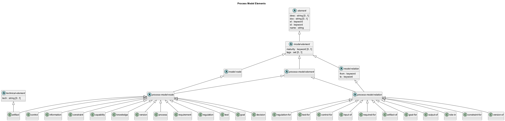

# Process Model Elements

## Diagram

## Description
Shows the logical hierarchy of the process model elements

## Classes
| Class | Description |
|---|---|
| [artifact](../../overarch/data-model/artifact.md)| An artifact in the process model |
| [artifact-of](../../overarch/data-model/artifact-of.md)| A relation between artifacts and other process or deployment model nodes. |
| [capability](../../overarch/data-model/capability.md)| A capability in the process model |
| [constraint](../../overarch/data-model/constraint.md)| A constraint in the process model |
| [constraint-for](../../overarch/data-model/constraint-for.md)| A relation between constraint and other elements. |
| [control](../../overarch/data-model/control.md)| A control in the process model |
| [control-for](../../overarch/data-model/control-for.md)| A relation between control and other elements. |
| [decision](../../overarch/data-model/decision.md)| An decision in the process model |
| [element](../../overarch/data-model/element.md)| An element of data. |
| [goal](../../overarch/data-model/goal.md)| An goal in the process model |
| [goal-for](../../overarch/data-model/goal-for.md)| A relation between goal and other elements. |
| [information](../../overarch/data-model/information.md)| An information in the process model |
| [input-of](../../overarch/data-model/input-of.md)| A relation between artifacts, information or knowledge and processes. |
| [knowledge](../../overarch/data-model/knowledge.md)| A process in the process model |
| [model-element](../../overarch/data-model/model-element.md)| An element which describes the relation of elements. |
| [model-node](../../overarch/data-model/model-node.md)| An element which is a node in the model. |
| [model-relation](../../overarch/data-model/model-relation.md)| An element which is a relation in the and describes the relationship of two model nodes. |
| [output-of](../../overarch/data-model/output-of.md)| A relation between artifacts, information or knowledge and processes. |
| [process](../../overarch/data-model/process.md)| A process in the process model |
| [process-model-element](../../overarch/data-model/process-model-element.md)| An element in the process model |
| [process-model-node](../../overarch/data-model/process-model-node.md)| A node in the process model |
| [process-model-relation](../../overarch/data-model/process-model-relation.md)| A relation in the process model |
| [regulation](../../overarch/data-model/regulation.md)| A regulation in the process model |
| [regulation-for](../../overarch/data-model/regulation-for.md)| A relation between regulation and other elements. |
| [required-for](../../overarch/data-model/required-for.md)| A relation between other nodes and capabilities. |
| [requirement](../../overarch/data-model/requirement.md)| A requirement in the process model |
| [role-in](../../overarch/data-model/role-in.md)| A relation between persons and organization units or processes. |
| [technical-element](../../overarch/data-model/technical-element.md)| An element which is implemented in the given technologies. |
| [test](../../overarch/data-model/test.md)| A test in the process model |
| [test-for](../../overarch/data-model/test-for.md)| A relation between a test and other elements. |
| [version](../../overarch/data-model/version.md)| A version of an artifact in the process model |
| [version-of](../../overarch/data-model/version-of.md)| A relation between versions and artifacts. |

## Navigation
[List of views in namespace](./views-in-namespace.md)

[List of all Views](../../views.md)

(generated by [Overarch](https://github.com/soulspace-org/overarch) with template docs/view.md.cmb)

