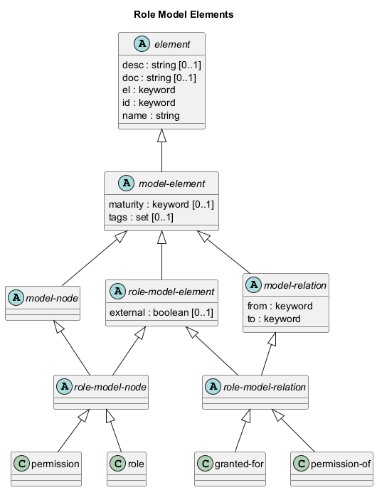

# Role Model Elements

## Diagram

## Description
Shows the logical hierarchy of the role model elements

## Classes
| Class | Description |
|---|---|
| [element](../../overarch/data-model/element.md)| An element of data. |
| [granted-for](../../overarch/data-model/granted-for.md)| A relationship between a permission and a role. |
| [model-element](../../overarch/data-model/model-element.md)| An element which describes the relation of elements. |
| [model-node](../../overarch/data-model/model-node.md)| An element which is a node in the model. |
| [model-relation](../../overarch/data-model/model-relation.md)| An element which is a relation in the and describes the relationship of two model nodes. |
| [permission](../../overarch/data-model/permission.md)| A permission, entitlement or access right for some action e.g. in a system. |
| [permission-of](../../overarch/data-model/permission-of.md)| A relationship between a permission and an architecture node, e.g. a system. |
| [role](../../overarch/data-model/role.md)| A human actor or role working with the system under description. A person can be used in the architecture model and the use case model. |
| [role-model-element](../../overarch/data-model/role-model-element.md)| An element of the role model. |
| [role-model-node](../../overarch/data-model/role-model-node.md)| A node in the role model. |
| [role-model-relation](../../overarch/data-model/role-model-relation.md)| A relation in the role model. |

## Navigation
[List of views in namespace](./views-in-namespace.md)

[List of all Views](../../views.md)

(generated by [Overarch](https://github.com/soulspace-org/overarch) with template docs/view.md.cmb)

