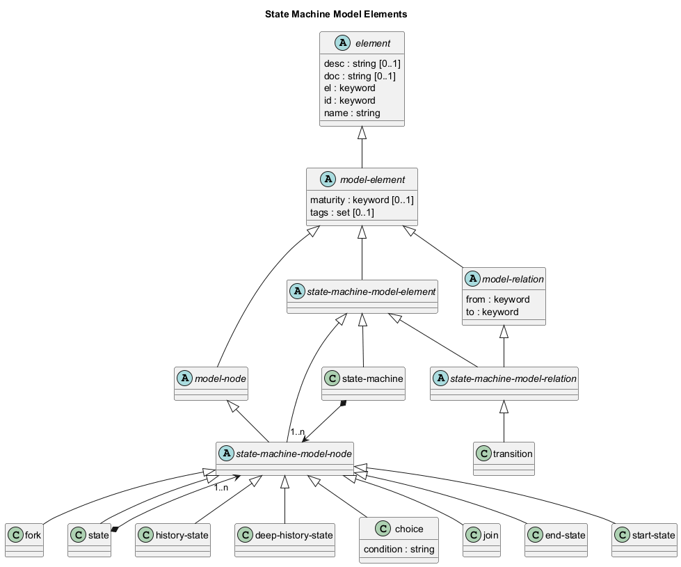

# State Machine Model Elements

## Diagram

## Description
Shows the logical hierarchy of the state machine model elements

## Classes
| Class | Description |
|---|---|
| [choice](../../overarch/data-model/choice.md)| A choice of transitions in a state machine. A choice has a single incoming transition and multiple outgoing transitions with the result of the condition of the choice. |
| [deep-history-state](../../overarch/data-model/deep-history-state.md)| A state with a deep history. |
| [element](../../overarch/data-model/element.md)| An element of data. |
| [end-state](../../overarch/data-model/end-state.md)| A end state in a state machine. |
| [fork](../../overarch/data-model/fork.md)| A fork of transitions in a state machine. A fork has a single incoming transition and multiple outgoing transitions. |
| [history-state](../../overarch/data-model/history-state.md)| A state with history. |
| [join](../../overarch/data-model/join.md)| A join of transitions in a state machine. A join has multiple incoming transitions and a single outgoing transition. |
| [model-element](../../overarch/data-model/model-element.md)| An element which describes the relation of elements. |
| [model-node](../../overarch/data-model/model-node.md)| An element which is a node in the model. |
| [model-relation](../../overarch/data-model/model-relation.md)| An element which is a relation in the and describes the relationship of two model nodes. |
| [start-state](../../overarch/data-model/start-state.md)| A start state in a state machine. |
| [state](../../overarch/data-model/state.md)| A state in a state machine. |
| [state-machine](../../overarch/data-model/state-machine.md)| A state machine as root element of the state machine model. A state machine encapsulates a set of states of a system and the transitions between these states. |
| [state-machine-model-element](../../overarch/data-model/state-machine-model-element.md)| An element in a state machine model. |
| [state-machine-model-node](../../overarch/data-model/state-machine-model-node.md)| A node in the state machine model. |
| [state-machine-model-relation](../../overarch/data-model/state-machine-model-relation.md)| A relation in the state machine model. |
| [transition](../../overarch/data-model/transition.md)| A transition from on state to another in effect of an event in the state machine. |

## Navigation
[List of views in namespace](./views-in-namespace.md)

[List of all Views](../../views.md)

(generated by [Overarch](https://github.com/soulspace-org/overarch) with template docs/view.md.cmb)

