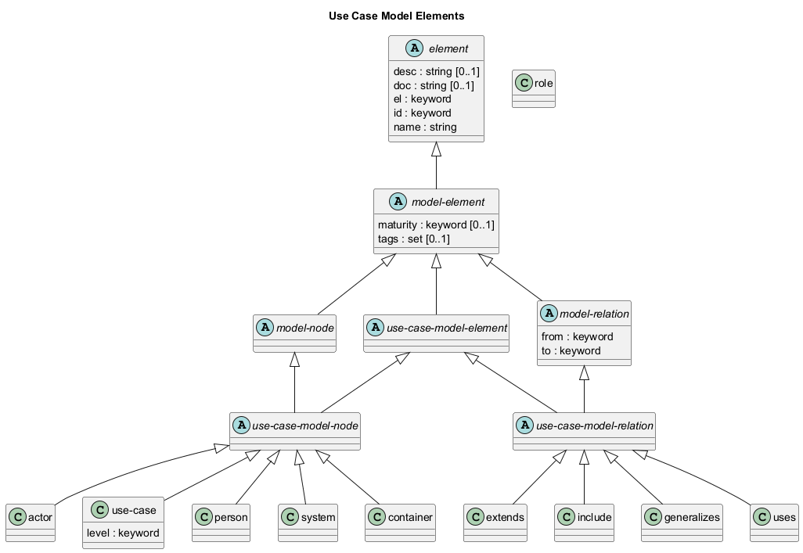

# Use Case Model Elements

## Diagram

## Description
Shows the logical hierarchy of the use case model elements

## Classes
| Class | Description |
|---|---|
| [actor](../../overarch/data-model/actor.md)| An actor (role) in a use case model. The actor can be human or technical, e.g. a system or time. If the architecture model contains persons or systems acting with the use cases, you can replace the actors with these elements. |
| [container](../../overarch/data-model/container.md)| A container is a part of a system and describes a deployed process in the architecture (e.g. a service or an application). A container is a compound element which contains the components of the implementation. A container can be used in the architecture model, the deployment model and the use case model. |
| [element](../../overarch/data-model/element.md)| An element of data. |
| [extends](../../overarch/data-model/extends.md)| An extends relationship between two use cases. |
| [generalizes](../../overarch/data-model/generalizes.md)| A generalizes relationship between two use case elements. |
| [include](../../overarch/data-model/include.md)| A include relationship between two use cases. |
| [model-element](../../overarch/data-model/model-element.md)| An element which describes the relation of elements. |
| [model-node](../../overarch/data-model/model-node.md)| An element which is a node in the model. |
| [model-relation](../../overarch/data-model/model-relation.md)| An element which is a relation in the and describes the relationship of two model nodes. |
| [person](../../overarch/data-model/person.md)| A human actor or role working with the system under description. A person can be used in the architecture model and the use case model. |
| [role](../../overarch/data-model/role.md)| A human actor or role working with the system under description. A person can be used in the architecture model and the use case model. |
| [system](../../overarch/data-model/system.md)| A system relevant in the architecture. A system can be an external system, which is modelled as a black box or an internal system, a system under description, which is modelled as a compound element with all the containers of the system. A system can be used in the architecture model, the deployment model (external systems) and the use case model (external systems). |
| [use-case](../../overarch/data-model/use-case.md)| A use case in the use case model. |
| [use-case-model-element](../../overarch/data-model/use-case-model-element.md)| An element in a use case model. |
| [use-case-model-node](../../overarch/data-model/use-case-model-node.md)| A node in the use case model of overarch. |
| [use-case-model-relation](../../overarch/data-model/use-case-model-relation.md)| A relation in the use case model of overarch. |
| [uses](../../overarch/data-model/uses.md)| A use relationship between an actor and a use case (or vice versa). |

## Navigation
[List of views in namespace](./views-in-namespace.md)

[List of all Views](../../views.md)

(generated by [Overarch](https://github.com/soulspace-org/overarch) with template docs/view.md.cmb)

