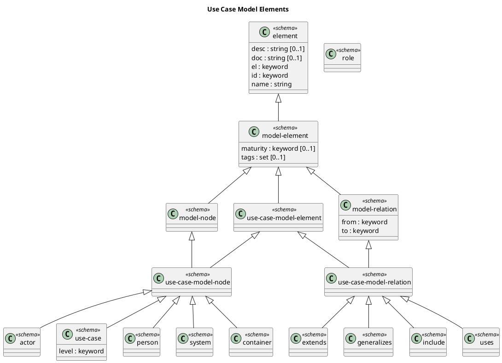

# Use Case Model Elements

## Diagram

## Description
Shows the logical hierarchy of the use case model elements

## Navigation
[List of views in namespace](./views-in-namespace.md)

[List of all Views](../../views.md)

(generated by [Overarch](https://github.com/soulspace-org/overarch) with template docs/view.md.cmb)

