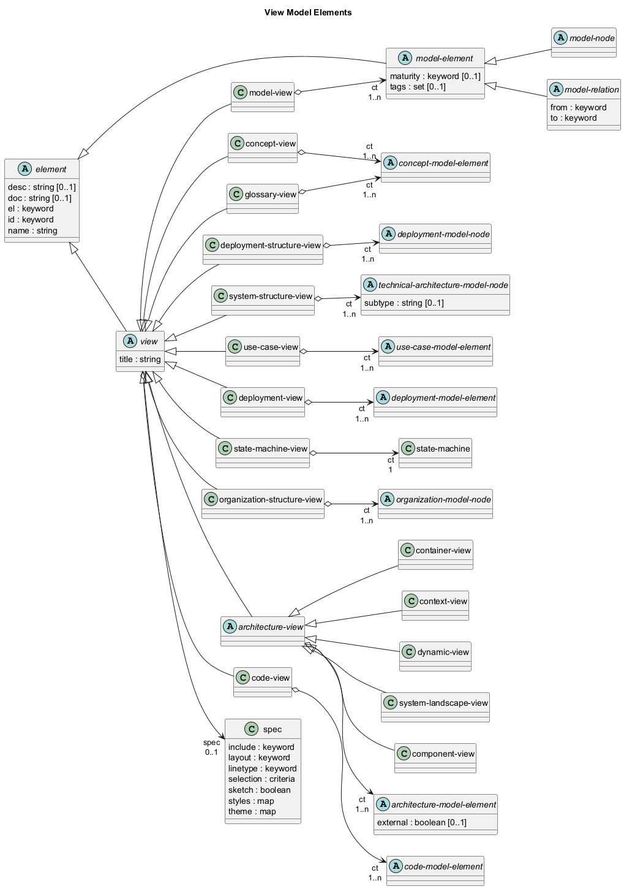

# View Model Elements

## Diagram

## Description
Shows the logical hierarchy of the organization model elements

## Classes
| Class | Description |
|---|---|
| [architecture-model-element](../../overarch/data-model/architecture-model-element.md)| An element of the architecture model. |
| [architecture-view](../../overarch/data-model/architecture-view.md)| An architectural view. |
| [code-model-element](../../overarch/data-model/code-model-element.md)| An element in a code model. |
| [code-view](../../overarch/data-model/code-view.md)| The code view is a static design view. It shows the code structure of some components of the system. |
| [component-view](../../overarch/data-model/component-view.md)| The component view is a static architectural view. It shows the component structure of a container and the interactions between these components and with it's environment consisting of users and external systems. |
| [concept-model-element](../../overarch/data-model/concept-model-element.md)| An element in the concept model. |
| [concept-view](../../overarch/data-model/concept-view.md)| The concept view is a graphical view. It shows the concepts as a concept map with the relations between the concepts. |
| [container-view](../../overarch/data-model/container-view.md)| The container view is a static architectural view. It shows the process structure of the system under description and the interactions between these containers and with it's environment consisting of users and external systems. |
| [context-view](../../overarch/data-model/context-view.md)| The (system) context view is a static architectural view. It shows the system under description and the interactions with it's environment consisting of users and external systems. |
| [deployment-model-element](../../overarch/data-model/deployment-model-element.md)| An element in the deployment model. |
| [deployment-model-node](../../overarch/data-model/deployment-model-node.md)| A node in the deployment model. |
| [deployment-structure-view](../../overarch/data-model/deployment-structure-view.md)| The deployment structure view is a graphical view. It shows the hierarchy of the infrastructure and deployments as an organigram. |
| [deployment-view](../../overarch/data-model/deployment-view.md)| The deployment view is a static architectural view. It shows the deployment of a system with the infrastructure modelled as nodes and the containers of the system deployed in these nodes. |
| [dynamic-view](../../overarch/data-model/dynamic-view.md)| The dynamic view is an architectural and behavioural view. It shows the order of some interactions between elements of the architecture. |
| [element](../../overarch/data-model/element.md)| An element of data. |
| [glossary-view](../../overarch/data-model/glossary-view.md)| The glossary view is a textual view. It shows the main elements and concepts of the system under description alphabetically sorted. |
| [model-element](../../overarch/data-model/model-element.md)| An element which describes the relation of elements. |
| [model-node](../../overarch/data-model/model-node.md)| An element which is a node in the model. |
| [model-relation](../../overarch/data-model/model-relation.md)| An element which is a relation in the and describes the relationship of two model nodes. |
| [model-view](../../overarch/data-model/model-view.md)| The model view is a graphical view. It shows all selected elements as a graph. |
| [organization-model-node](../../overarch/data-model/organization-model-node.md)| A node in the organization model |
| [organization-structure-view](../../overarch/data-model/organization-structure-view.md)| The organization structure view is a graphical view. It shows the hierarchy of the organization and its parts as an organigram. |
| [spec](../../overarch/data-model/rendering-spec.md)| A specification of the rendering options for a view. |
| [state-machine](../../overarch/data-model/state-machine.md)| A state machine as root element of the state machine model. A state machine encapsulates a set of states of a system and the transitions between these states. |
| [state-machine-view](../../overarch/data-model/state-machine-view.md)| The state machine view is a behavioural design view. It shows states and transitions of a state machine. |
| [system-landscape-view](../../overarch/data-model/system-landscape-view.md)| The system landscape view is a static architectural view. It shows the broader context of the system under description. It contains the system under descriptions, it's direct users and interacting external systems and maybe additional systems and users which play a role in the broader context of the system under description. |
| [system-structure-view](../../overarch/data-model/system-structure-view.md)| The system structure view is a graphical view. It shows the hierarchy of the system and its parts as an organigram. |
| [technical-architecture-model-node](../../overarch/data-model/technical-architecture-model-node.md)| A technical node in the architecture model. |
| [use-case-model-element](../../overarch/data-model/use-case-model-element.md)| An element in a use case model. |
| [use-case-view](../../overarch/data-model/use-case-view.md)| The use case view is a behavioural view of the (functional) requirements. It shows the actors of the system and the use cases to provide an overview of the functionality of the system under description. |
| [view](../../overarch/data-model/view.md)| An element for describing a view. |

## Navigation
[List of views in namespace](./views-in-namespace.md)

[List of all Views](../../views.md)

(generated by [Overarch](https://github.com/soulspace-org/overarch) with template docs/view.md.cmb)

