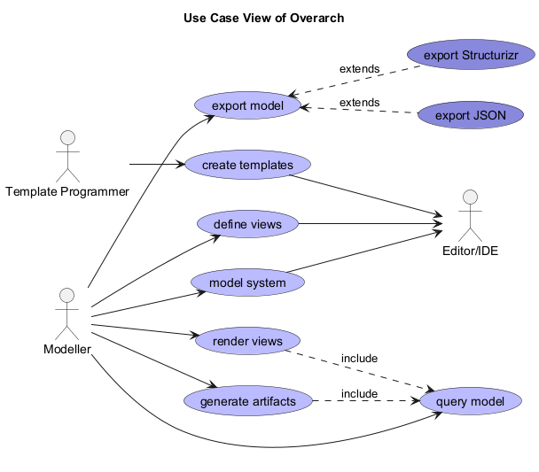

# define views (Use-case)
## Description
Textually define views of the system in the Overarch view model.

## Actors
| Actor | Description |
|---|---|
| [Modeller](../../overarch/roles/modeller.md)| Models the architecture of a system and specifies views of the model. |
## Actor in Use Cases
| Use Case | Description |
|---|---|
| [Editor/IDE](../../overarch/architecture/editor.md)| Tool for describing the architecture model and the views. |

## Use Case View

[Use Case View of Overarch](../../overarch/use-case/use-case-view.md)

## Navigation
[List of views in namespace](./views-in-namespace.md)

[List of all Views](../../views.md)

(generated by [Overarch](https://github.com/soulspace-org/overarch) with template docs/node.md.cmb)
